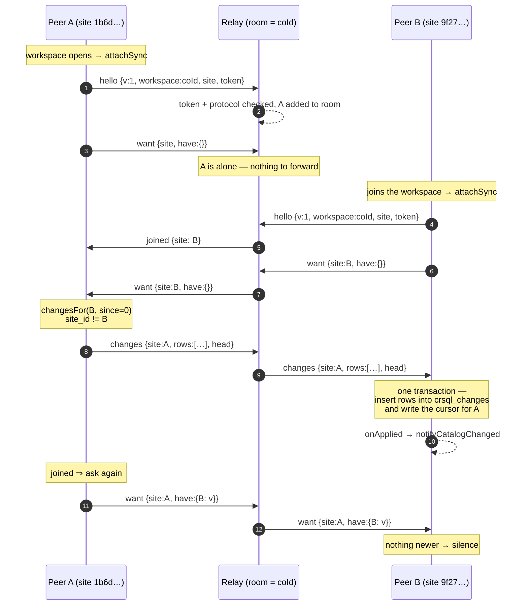
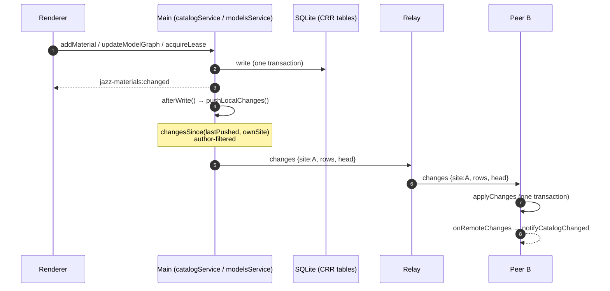

# Peer-to-peer SQLite: architecture overview

How two Klippel peers end up holding the same catalog and the same models.

The store of record is a per-workspace SQLite database
(`~/klippel/envs/<env>/workspaces/<name>/klippel.sqlite`), with **cr-sqlite**
turning its domain tables into CRRs — conflict-free replicated relations. Every
write on a CRR table records per-column change rows; shipping those rows to
another peer and inserting them there is the whole of replication. Merge is the
database's job, not ours.

This replaces cojson's sync for domain data. Why we left Jazz:
[jazz-is-dead.md](../../../../src/docs/jazz-is-dead.md). What it costs at scale
and how that is held: [scalability.md](./scalability.md).

> **Transitional:** workspace *identity* is still Jazz's. Sharing mints a
> `coId` and joining resolves that CoValue from a cojson sync server, so a
> collaborative session today runs **two** servers — the cojson one for
> identity, the relay below for data. When the Jazz layer is deleted the `coId`
> becomes a plain share id and the second server goes with it.

## The pieces

| File | Role |
|---|---|
| `sync/protocol.ts` | The four messages, and the trust model in writing. |
| `sync/wire.ts` | `crsql_changes` rows ↔ JSON, tagged by SQLite storage class. |
| `sync/client.ts` | Cursors, catch-up, applying, pushing. All the logic. |
| `sync/relay.ts` | A WebSocket hub. Rooms, and forwarding. Stores nothing. |
| `sync/relayMain.ts` | The relay as its own process (`dist/…/sync-relay.js`). |
| `sync/index.ts` | Attaches a client to the workspace database's lifetime. |

## Lifetimes and identity

- **A client syncs a database, for exactly as long as that database is open.**
  `attachSync` runs inside `workspaceDb()` and when a workspace opens
  (`openWorkspaceJazzNodeInner`); `detachSync` runs at the top of
  `closeWorkspaceDb()`, before the handle the client holds statements against
  goes away. Pointing a client at a database that has since been swapped is how
  you replicate one workspace's rows into another.
- **The room is the workspace `coId`** — the identity two peers agreed on when
  one shared and the other joined. Never the local folder name: each peer names
  its own copy, and the join dialog offers a rename.
- **Sharing decides whether to sync**; `KLIPPEL_SYNC_URL` only overrides
  *where*. It deliberately cannot switch sync on, or every peer would join a
  room named after whatever workspace it happened to have open, and two
  unrelated databases that share a folder name would replicate into each other.
- **A site id** (`crsql_site_id()`) identifies a *database*, not a user. Two
  peers with equal site ids are one env dir opened twice, and would overwrite
  rather than merge — which is why the debug session asserts they differ.

## The handshake

Two details in there are the answers to bugs, not decoration:

- **`joined` is broadcast by the relay** — the one message it originates.
  Without it, catch-up depended on connection order: a peer asks `want` once
  when it connects, and a peer that connects later never hears the question. On
  a join, every member re-asks, so a gap closes whichever way round the two
  peers arrived.
- **`want` is sent on every connect, not just the first.** While a peer was
  away the room moved on.

## A local write

- **Pushes are event-driven, not polled.** A write path calls `push()`; an idle
  peer does no work and an edit leaves the machine immediately.
- **A push carries only locally authored changes.** A peer that has just caught
  up holds everyone else's history too; without the author filter its next edit
  echoed all of it back — measured at 193 898 rows re-sent after one edit.
  Nothing is lost: catch-up is `want`'s job, and `changesFor` answers with
  everything a peer holds regardless of author.
- **`lastPushed` is in-memory on purpose.** It is an optimisation, not a
  correctness cursor; after a restart the `want` exchange re-establishes what
  each peer is missing.
- **The remote path raises the same tick a local write does**
  (`notifyCatalogChanged`), so the renderer needed no new code to see a peer's
  changes.

## Applying a batch

Three things happen inside one transaction, and each is deliberate:

1. **Rows are inserted into `crsql_changes`**, cr-sqlite's write interface. It
   re-stamps each with the local clock while preserving the originating
   `site_id`, which is what lets a third peer relay a change it did not write.
2. **The sender's cursor is written** to `crsql_tracked_peers` — in the same
   transaction as the rows it describes, or a crash between them would skip
   changes forever. The cursor tracks the *sender's* clock, not the author's.
3. **CHECK constraints are suspended** (`ignore_check_constraints`). A change
   row carries one column, so an incoming row is materialised from column
   defaults and then filled in; `material_edges.type IN (…)` rejected that
   intermediate row, the batch failed whole, and the peers silently stopped
   converging. A check describes a *complete* row, which a merge only produces
   at the end of its transaction. Local writes are still fully checked.

A batch lands whole or not at all: half of it would leave a material without
the edges that give it an industry, which the renderer reads as lost relations.

## Failure and recovery

- **The relay is a courier, not a dependency.** Every read and write works with
  it unreachable; what is lost is other people's changes, not the app.
- **Reconnect** is a bounded backoff (`min(30s, 500ms · 2^n)`, n capped at 6),
  and a reconnect re-asks. A relay restart does not need an app restart — the
  two-peer session survives one, which is how that path got exercised.
- **One bad batch does not take the connection down.** It is logged, the peer
  stays online, and it re-asks on the next connect.
- **A relay holds no state**, so it can be restarted, replaced, or moved. Peers
  hold everything and answer each other.

## Trust model — read before changing anything

**The relay is trusted.** It sees every change in plaintext and nothing stops
it forging one. This is a deliberate step down from Jazz, where every change
was signed by its author and the relay saw only ciphertext
([join-workspaces.md](../../../../src/docs/join-workspaces.md)). Rebuilding that
means client-side encryption plus per-peer signatures — a crypto design rather
than a transport, interacting badly with a merge the database performs for us.

Consequences, which are not optional:

- A relay must be operated by whoever owns the data. **A public relay is not an
  option under this design.**
- Peers authenticate with a shared `KLIPPEL_SYNC_TOKEN`, read from the
  environment rather than argv (an argv is visible to every process on the
  host). A peer presenting the wrong token is closed (4401) rather than
  ignored, so a misconfiguration fails loudly.
- A socket that has not said `hello` is in no room and cannot inject anything.
- Arriving rows are not engine-validated (the CHECK suspension above). Tolerable
  only because every peer is already trusted.

## Running it

- **Debug session:** `Debug Two Peers (Collaborative, HMR)` launches the relay
  (`:4300`) beside the cojson server (`:4242`), points both peers at it, and
  `scripts/two-peer-share.mjs` asserts both report a connected relay in the same
  room with distinct site ids before handing the session over.
- **Standalone:** `npm run sync:relay` (esbuilds from source), or
  `node dist/electron/main/sync-relay.js --port 4300` from a build.
- **Status:** `window.electron.jazz.syncStatus()` — its `relay` block carries
  room, url, site, connected and the pushed/applied counters. The systray peers
  indicator shows the same. A connected relay that has carried nothing is a
  different problem from one that is not connected, so both are visible.
- **Tests:** `npm run test:e2e:collaborative`. The harness spawns both servers
  and gives each peer both URLs.
