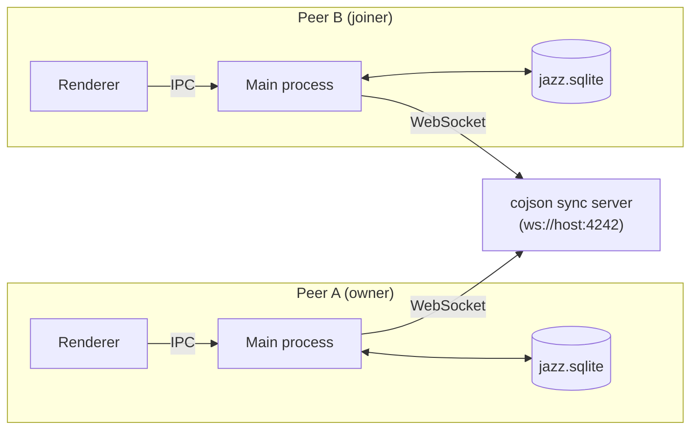
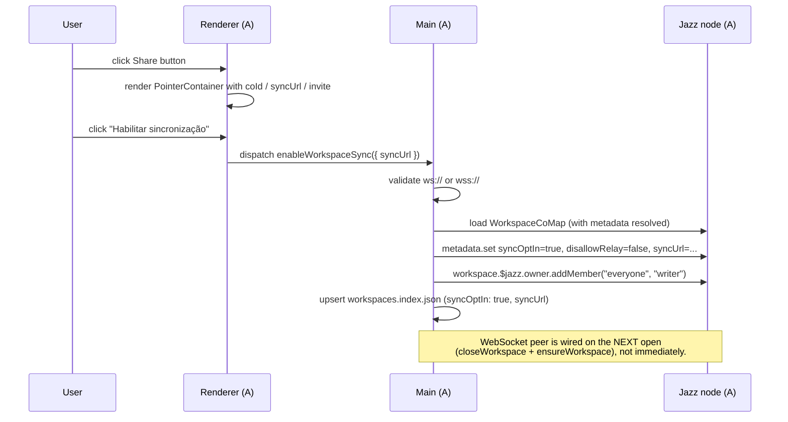

# Joining a peer's workspace

How collaborative workspaces work in Klippel: the trust model, the actors involved, and the exact byte-for-byte flow when one user shares a workspace and another joins it.

The Jazz foundation underneath this doc is described in [`user-management.md`](./user-management.md); read that first if any of the terms `WorkspaceCoMap`, `EditLease`, or "cojson peer" are unfamiliar.

## TL;DR

1. A **sync server** is a tiny relay that knows nothing about the workspace content — it just forwards signed CoValue messages between peers.
2. The **owner** of a workspace clicks **Share**, which flips `syncOptIn` on the workspace, grants `"everyone" → "writer"` on the workspace group, and yields an invite `klippel://join?coId=…&syncUrl=…`.
3. Another user pastes the invite into **Join**, which spins up a local SQLite-backed Jazz node, connects to the sync server, loads the workspace by `coId`, and registers it locally.
4. From then on, every model edit on either side is signed by the editor's account and replicated via the sync server. The lease (`EditLease`) prevents concurrent writers to the same model.

## The actors



Each peer is an independent Electron process with its own Jazz node, its own SQLite store, and its own account credentials. The sync server only sees opaque encrypted message payloads — it cannot read content, edit anything, or impersonate either peer. CoValue authority comes from cryptographic signatures on every change, not from trusting the relay.

## Trust model (v1)

- **Knowledge of `coId` == collaborator.** When `Share` is clicked, the workspace's group grants `"everyone" → "writer"`. Anyone who pastes the `coId` into Join, can load and edit the workspace.
- **Tighter ACLs are out of scope for v1.** Future iterations can swap `"everyone"` for explicit per-account grants once we have account discovery / invite signing.
- **The sync server is untrusted.** It can withhold or delay messages, but it cannot forge them. If you don't trust the relay operator, run your own (`npm run jazz:sync`) on a LAN host.
- **Sync URL must be `ws://` or `wss://`** with no embedded credentials. Validation lives in [`jazz.ts`](../../electron/main/jazz.ts) — both the env-var path and the Join IPC re-validate.

## What `Share` actually does



Two things to call out:

1. **Idempotent.** Sharing the same workspace twice is a no-op beyond rewriting the `WorkspaceMetadata` field.
2. **The WS peer is opened by an immediate re-open.** Jazz takes `peers: [...]` at context creation, so the only way to wire a peer onto a running workspace is to close and reopen the node. `enableJazzWorkspaceSync` does this synchronously after writing the metadata — by the time the IPC resolves, the WebSocket peer is dialing the sync server and remote joiners can already `WorkspaceCoMap.load(coId)`. Without this reopen, A would happily flip its own metadata while the relay never sees the workspace history.

## What `Join` actually does

```mermaid
sequenceDiagram
  participant U as User
  participant R as Renderer (B)
  participant M as Main (B)
  participant S as Sync server
  participant A as Peer A

  U->>R: paste klippel://join?coId=…&syncUrl=…
  R->>R: parseInvite() → fills coId / syncUrl / name
  U->>R: confirm
  R->>M: dispatch joinWorkspace({ name, coId, syncUrl })
  M->>M: validate ws:// or wss://; reject if name already exists
  M->>M: upsert workspaces.index.json (syncOptIn: true, syncUrl)
  M->>M: ensureDir + write .jazz-id = coId
  M->>M: openWorkspaceJazzNode(name) — opens SQLite, dials WS peer
  M->>S: WebSocket connect
  S->>A: forward hello
  A->>S: send WorkspaceCoMap history
  S->>M: forward history
  M->>M: WorkspaceCoMap.load(coId) resolves
  M-->>R: return WorkspaceIndexEntry
  R->>R: dispatch selectWorkspace → workspace is active
```

The interesting moments:

- **Pre-register before opening the node.** The index entry and `.jazz-id` are written *before* `openWorkspaceJazzNode`, so the boot path picks up the sync settings on the first peer dial. If anything below fails, the entry is rolled back so retries don't hit the "already exists" guard.
- **`WorkspaceCoMap.load` is the rendezvous point.** It's how peer B knows the sync has actually delivered the root CoValue. If the server is down or the URL is wrong, this rejects and the join is rolled back.
- **Models stream on demand.** `loadModel(id)` triggers the per-model CoValue load, which fetches its history from the relay if not already cached locally. SQLite caches it for offline reopens.

## End-to-end happy path

```mermaid
sequenceDiagram
  participant A as Peer A
  participant S as Sync server
  participant B as Peer B

  Note over A,B: 1. Owner creates workspace + model.
  A->>A: createWorkspace, createModel
  Note over A: workspaces.index.json updated;<br/>graph stored in jazz.sqlite

  Note over A,B: 2. Owner enables sync.
  A->>A: enableWorkspaceSync (everyone→writer, syncOptIn=true)
  A->>A: closeWorkspace + ensureWorkspace
  A->>S: WebSocket connect; publish workspace history

  Note over A,B: 3. Owner shares the invite (paste, chat, etc).
  Note over A,B: out of band: klippel://join?coId=…&syncUrl=…

  Note over A,B: 4. Joiner opens the invite.
  B->>B: joinWorkspace({name, coId, syncUrl})
  B->>S: WebSocket connect
  S->>B: stream WorkspaceCoMap + ModelsMap history
  B->>B: WorkspaceCoMap.load resolves

  Note over A,B: 5. Concurrent editing protected by EditLease.
  A->>A: acquireEditLease(modelId) → EditLease set on model
  S->>B: forward EditLease change
  B->>B: useEditLease hook flips to held_by_other → LeaseBanner shows
  A->>A: edits graphJson, releases lease
  S->>B: forward graphJson change + lease=undefined
```

## File-level reference

| Concern | Main process | Renderer |
|---|---|---|
| WS peer wiring on workspace open | [`jazz.ts` — `openWorkspaceJazzNodeInner`](../../electron/main/jazz.ts) | — |
| Join entry point | [`jazz.ts` — `joinJazzWorkspace`](../../electron/main/jazz.ts) | [`JoinWorkspaceButton.tsx`](../kernel/modules/Store/components/JoinWorkspaceButton.tsx) |
| Share / opt-in | [`jazz.ts` — `enableJazzWorkspaceSync`](../../electron/main/jazz.ts) | [`ShareWorkspaceButton.tsx`](../kernel/modules/Store/components/ShareWorkspaceButton.tsx) |
| Workspace index | [`workspacesIndex.ts`](../../electron/main/workspacesIndex.ts) | — |
| Preload bridge | [`preload/jazz.ts`](../../electron/preload/jazz.ts) | — |
| Schema (incl. `WorkspaceMetadata.syncUrl`) | — | [`schema.ts`](../kernel/modules/Store/schema.ts) |
| Store actions / middlewares | — | [`actions.ts`](../kernel/modules/Store/actions.ts), [`middlewares.ts`](../kernel/modules/Store/middlewares.ts) |
| Lease banner | — | [`LeaseBanner.tsx`](../system/modules/Composer/components/viewports/ModelViewport/LeaseBanner.tsx) |
| Sync server | `npm run jazz:sync` → `jazz-run sync --in-memory --port 4242` | — |

## Running locally with two windows

The harness will automate this for tests; for manual exploration:

```sh
# Terminal 1 — sync server (memory-only)
cd webapp && npm run jazz:sync

# Terminal 2 — peer A
cd webapp && npm run prebuild   # one-shot build
ENV_NAME=peerA \
  KLIPPEL_CDP_PORT=9222 \
  KLIPPEL_USER_DATA_DIR=/tmp/klippel-peerA \
  ./node_modules/.bin/electron .

# Terminal 3 — peer B
ENV_NAME=peerB \
  KLIPPEL_CDP_PORT=9223 \
  KLIPPEL_USER_DATA_DIR=/tmp/klippel-peerB \
  ./node_modules/.bin/electron .
```

Then in peer A's window: create a workspace, click **Share**, click **Habilitar sincronização**, copy the invite. In peer B's window: click **Join**, paste, confirm. The workspace selector flips to the joined workspace; any model A creates appears in B's model list after a brief sync delay.

## Failure modes

| Symptom | Likely cause | Where to look |
|---|---|---|
| Join hangs, eventually throws "Could not load remote workspace" | Sync server down, wrong URL, or `coId` typo | sync server logs; verify URL with `curl -i http://host:port/` |
| Join succeeds but models do not appear on B | Group does not grant B access. Almost always means `enableWorkspaceSync` was *not* re-run after a stale workspace (created before Share existed) | check `WorkspaceMetadata.syncOptIn` on A; re-click Share |
| Models exist in `jazz.listModels()` IPC but the modal/list is empty | Composer renderer cache out of sync. The slice rehydrates from `.session/Composer/models/<id>.json` per-workspace; a freshly-joined workspace has no cache files. Fixed by the [`workspaceSelected` listener](../system/modules/Composer/store/models/middlewares.ts) that re-dispatches `listModels()` on every workspace switch. Symptom indicates a regression in that wiring | open the model-selection modal, which dispatches `listModels()` on mount; otherwise log the slice state and compare to the IPC return |
| `updateModelGraph` rejected with "is locked by another editor" | Another peer holds the EditLease | the LeaseBanner on the holder's side names them; wait or coordinate |
| `bufferutil` resolve error on app boot | `ws` not in dependencies (transitive only) | confirm `ws` is in `dependencies` in `package.json` so `externalizeDepsPlugin` keeps it out of the bundle |
| App throws `Cannot read properties of undefined (reading 'isPackaged')` | `ELECTRON_RUN_AS_NODE` leaked from a VS Code terminal | `unset ELECTRON_RUN_AS_NODE` before launching |

## Security notes

- The sync server in this repo is bound to `127.0.0.1` only. To run it on a LAN host, set the `--host` flag and ensure the network is trusted; the v1 trust model gives `"everyone"` write access on a shared workspace.
- The Share panel must not render the active account's sealer/signer secret. Only `coId` and `syncUrl` are exposed.
- The Join paste-parser only accepts `klippel://join?…`; other URI schemes are ignored. Field-level validation happens both in the renderer and (re-)in the main process before any disk write.

## Out of scope (deliberately)

- **Discovery.** There is no directory of available workspaces. Invites are pasted out of band.
- **Account-level revocation.** Once a peer has joined, you cannot kick them; rotate the workspace instead.
- **Conflict resolution beyond the lease.** `graphJson` is an atomic string; whoever writes last wins. The lease is the contract that prevents this in practice.
- **Production-grade relay.** `npm run jazz:sync --in-memory` is for development and tests. A persistent / authenticated relay is a separate concern.
