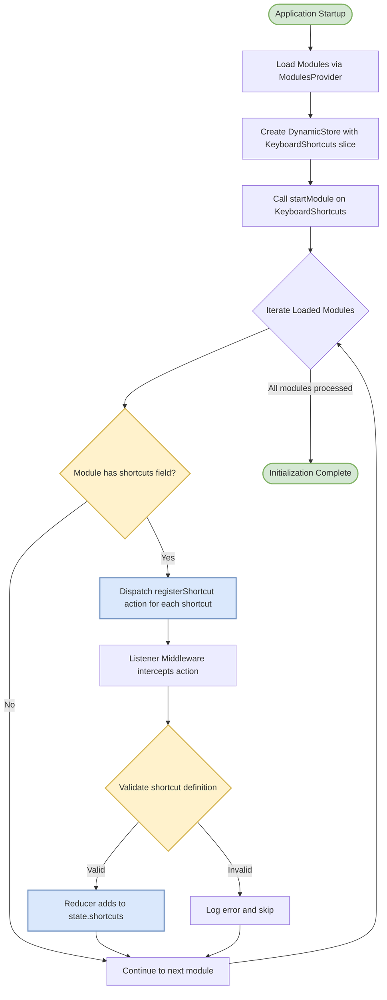
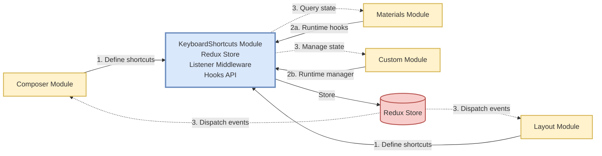
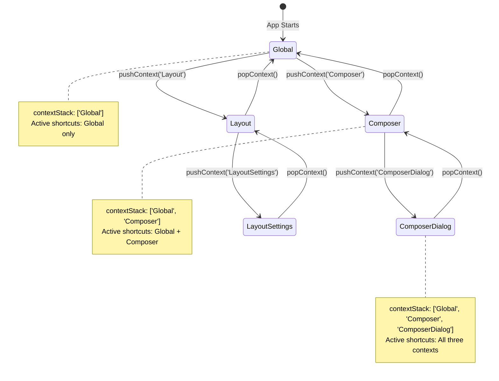
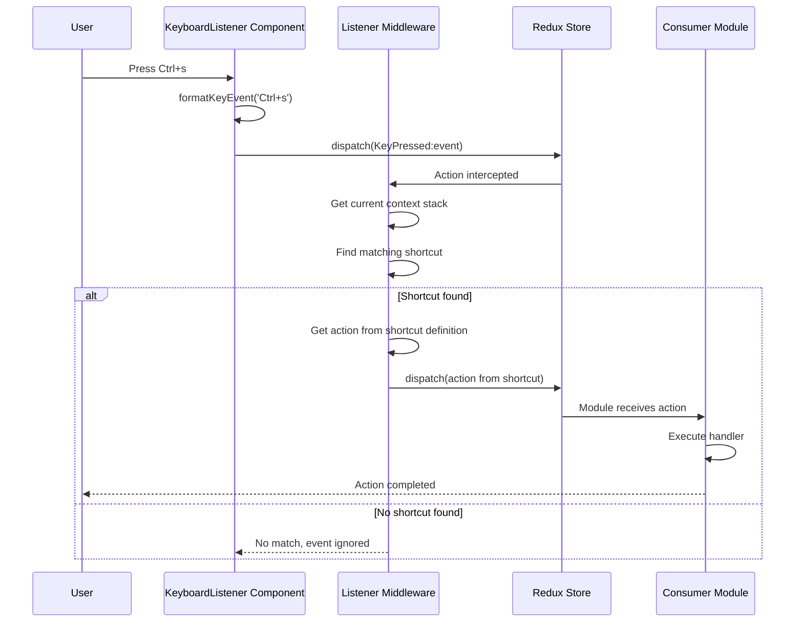
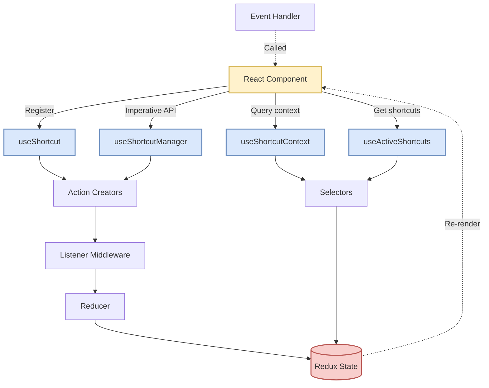
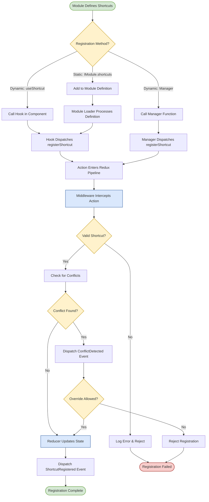
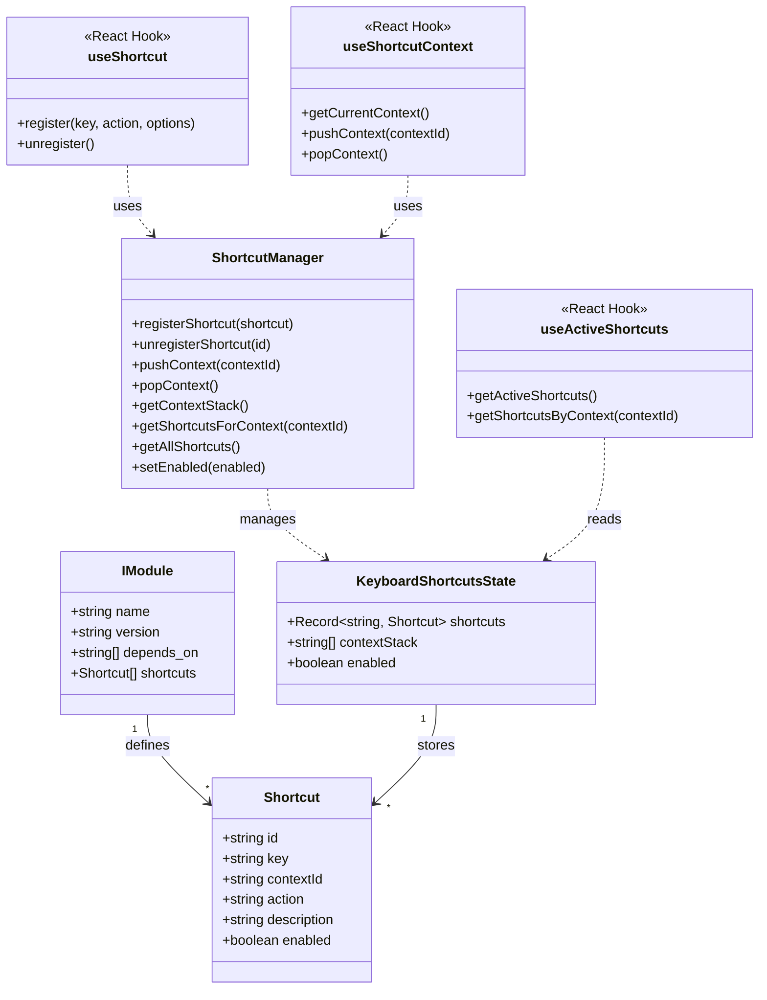

# KeyboardShortcuts Module Architecture Diagrams

This document contains standard diagrams using Mermaid notation, which is widely supported in VS Code, GitHub, and other markdown-aware tools.

## 1. Initialization Flow (BPMN-Style Process Diagram)



### Example: Composer Module Registration

```typescript
// Composer module defines shortcuts in IModule interface
const ComposerModule: IModule = {
  name: 'Composer',
  version: '1.0.0',
  depends_on: ['Store', 'KeyboardShortcuts'],
  shortcuts: [
    {
      id: 'composer.save',
      key: 'Ctrl+s',
      contextId: 'Composer',
      action: 'Composer:save',
      description: 'Save current composition'
    },
    {
      id: 'composer.undo',
      key: 'Ctrl+z',
      contextId: 'Composer',
      action: 'Composer:undo'
    }
  ]
};
```

### Redux State After Initialization

```typescript
{
  shortcuts: {
    'composer.save': {
      id: 'composer.save',
      key: 'Ctrl+s',
      contextId: 'Composer',
      action: 'Composer:save',
      description: 'Save current composition',
      enabled: true
    },
    'composer.undo': {
      id: 'composer.undo',
      key: 'Ctrl+z',
      contextId: 'Composer',
      action: 'Composer:undo',
      enabled: true
    }
  },
  contextStack: ['Global'],
  enabled: true
}
```

## 2. Module Consumption Flow (Data Flow Diagram)



### Interaction Patterns

1. **Static Registration (Phase 1a)**: Modules define shortcuts in their `IModule.shortcuts` field
   - Processed during module initialization
   - Shortcuts automatically registered before module starts

2. **Dynamic Registration (Phase 1b)**: Modules register shortcuts at runtime
   - Using `useShortcut` hook (React components)
   - Using `useShortcutManager` (imperative API)
   - Allows conditional/dynamic shortcut registration

3. **Event Listening (Phase 3a)**: Modules listen for keyboard events
   - Subscribe to `KeyPressed:event` actions
   - Use middleware to intercept and handle events
   - Redux-first pattern for event handling

4. **State Querying (Phase 3b)**: Modules query shortcut state
   - Use selectors to get active shortcuts
   - Use selectors to check context stack
   - Read-only access to global shortcut state

## 3. Context Stack Management (State Diagram)



### Context Stack Rules

- Context stack is a LIFO (Last In, First Out) stack
- Always starts with 'Global' context at the base
- Active shortcuts = union of all shortcuts in the current context stack
- Nested contexts inherit parent context shortcuts
- When a key is pressed, middleware searches from top of stack downward
- First matching shortcut wins (allows context-specific overrides)

## 4. Runtime Keyboard Event Flow (Sequence Diagram)



### Event Processing Steps

1. **Capture**: KeyboardListener captures browser keyboard event
2. **Normalize**: formatKeyEvent converts to standard string format
3. **Dispatch**: KeyPressed:event action dispatched to Redux
4. **Intercept**: Listener middleware intercepts the event
5. **Match**: Search active shortcuts for matching key combo
6. **Execute**: Dispatch the action defined in the matching shortcut
7. **Handle**: Consumer module handles the dispatched action

## 5. API Usage Patterns (Component Diagram)



## 6. BPMN-Style Shortcut Registration Process



## 7. Class Diagram: Module API Structure



## Diagram Rendering

These diagrams use [Mermaid](https://mermaid.js.org/) syntax and can be rendered in:
- **VS Code**: Install "Markdown Preview Mermaid Support" or "Mermaid Markdown Syntax Highlighting" extensions
- **GitHub/GitLab**: Native markdown preview support
- **Documentation tools**: Docusaurus, MkDocs, Hugo, etc.
- **Draw.io**: File → Import → Mermaid
- **Online**: https://mermaid.live/

## Diagram Types Used

1. **Flowchart/BPMN** (`graph TB/LR`): Process flows and decision trees
2. **State Diagram** (`stateDiagram-v2`): Context stack state transitions
3. **Sequence Diagram** (`sequenceDiagram`): Runtime event flows
4. **Class Diagram** (`classDiagram`): API structure and relationships

All diagrams follow standard notation conventions:
- Circles/Ovals: Start/End points (BPMN events)
- Rectangles: Processes/Tasks
- Diamonds: Decision gates/Conditions
- Dashed lines: Data flow/Query operations
- Solid lines: Control flow/Commands
- Database cylinders: Data storage
