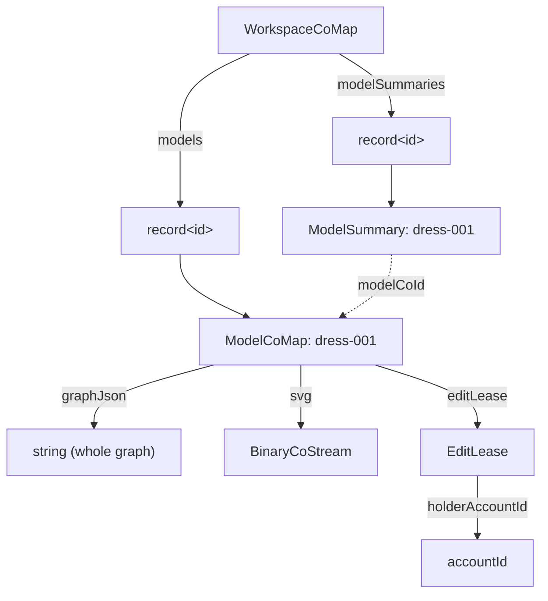
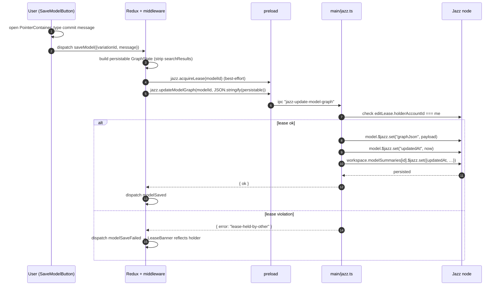
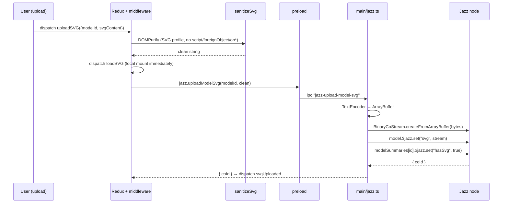
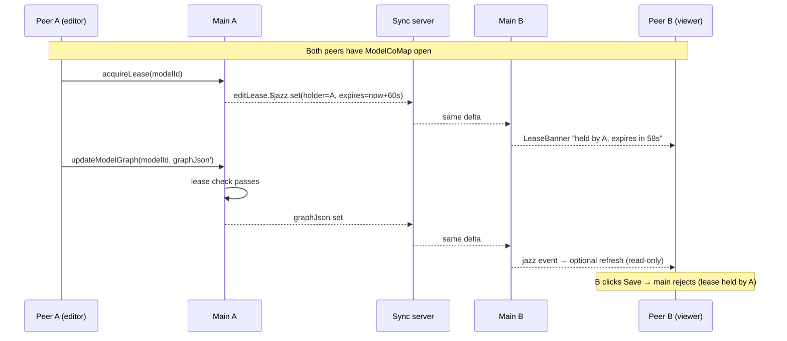
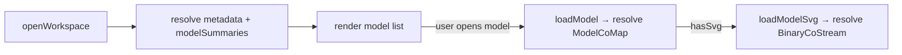

# Composer — Jazz storage & sync

> **History — Jazz is being removed.** This describes what exists today, not
> the direction. See [jazz-is-dead.md](../../../../docs/jazz-is-dead.md) before writing code against it.

How a Composer model is laid out on Jazz, how an explicit save travels from the viewport to other peers, and how the edit-lease keeps concurrent editors from clobbering each other.

For the kernel Jazz foundation (account, workspace, IPC) see [`kernel/modules/Store/docs/changes/2026-05-16-932980-jazz-foundation-and-models-migration.md`](../../../kernel/modules/Store/docs/changes/2026-05-16-932980-jazz-foundation-and-models-migration.md). For lazy hydration see [`kernel/modules/Store/docs/changes/2026-05-19-af9a0f-jazz-lazy-hydration.md`](../../../kernel/modules/Store/docs/changes/2026-05-19-af9a0f-jazz-lazy-hydration.md). For multi-peer plumbing see [`kernel/modules/Store/docs/changes/2026-05-18-b5c2fb-collaborative-jazz-multi-peer-harness.md`](../../../kernel/modules/Store/docs/changes/2026-05-18-b5c2fb-collaborative-jazz-multi-peer-harness.md). Performance rationale lives in [`webapp/src/docs/analysis/jazz-performance.md`](../../../../docs/analysis/jazz-performance.md).

## TL;DR

- A model is **one atomic `ModelCoMap`** keyed in `WorkspaceCoMap.models`. The whole composition graph is serialized to a `graphJson` string field.
- The model-list UI reads a **separate `ModelSummary` projection** (`WorkspaceCoMap.modelSummaries`) so listing doesn't drag every `graphJson` + SVG through IPC.
- SVGs are stored as `BinaryCoStream` (`ModelCoMap.svg`) — native Jazz blob sync.
- **Writes are explicit-save**, gated by an `EditLease` so two editors can't silently overwrite each other.
- Renderer talks to Jazz only through `window.electron.jazz.*`; the main process owns the `KlippelAccount`, cojson + SQLite, and the websocket relay.

## Data layout

```
KlippelAccount.root
└── workspaces: list<WorkspaceCoMap>
    └── WorkspaceCoMap
        ├── metadata        : WorkspaceMetadata
        ├── models          : record<id, ModelCoMap>          ← THIS MODULE (full body)
        │     ├─ id, name, description, updatedAt
        │     ├─ graphJson  : string                          (atomic, last-writer-wins on lease holder)
        │     ├─ svg?       : BinaryCoStream                  (chunked blob)
        │     └─ editLease? : EditLease { holderAccountId, acquiredAt, expiresAt }
        ├── modelSummaries  : record<id, ModelSummary>        ← THIS MODULE (projection)
        │     └─ id, modelCoId, name, description, updatedAt, hasSvg
        └── materials       : MaterialCatalogCoMap            ← Materials (per-CoValue)
```

Diagram:



The dotted `modelCoId` arrow is a plain string — `loadModel` resolves the full `ModelCoMap` from it on demand.

## Why atomic `graphJson` (vs Materials' per-cell CoValues)

| Concern              | Composer `ModelCoMap`                      | Materials catalog                       |
| -------------------- | ------------------------------------------ | --------------------------------------- |
| Lifetime             | Document opened by one editor at a time    | Long-lived shared state                 |
| Edit cadence         | Many local edits, **one explicit save**    | Small, frequent, multi-user            |
| Write coordination   | `EditLease` (single-writer)                | None — CRDTs merge per cell             |
| History bloat        | One CRDT entry per save (bounded)          | One per cell-edit (higher; accepted)    |
| Storage shape        | One atomic JSON string + one BinaryCoStream| One CoValue per node / edge / attribute |
| Listing cost         | Walks `modelSummaries` (small projection)  | Walks every node + edge record          |

Per-node CRDTs on Composer models would bloat history (a complex garment is hundreds of nodes; the editor mutates many per session) and would not buy much — only one user edits a model at a time, by design. The lease + atomic blob is the explicit choice; rationale in [`jazz-performance.md`](../../../../docs/analysis/jazz-performance.md).

## Process boundary

```
┌─ Renderer (React + Redux) ──────────────────────────────────────┐
│                                                                 │
│  ModelViewport / ModelList ──dispatch──▶ Redux commands         │
│       ▲                       │                                 │
│       │ events                ▼                                 │
│       └── store/{models,variations,svg}/slice.ts (extraReducers)│
│                               ▲                                 │
│                               │ event dispatch                  │
│              store/{models,variations}/middlewares.ts           │
│              hooks/useEditLease.ts (poll / renew / release)     │
│                               │                                 │
│                               ▼                                 │
│             window.electron.jazz.*  (preload bridge)            │
└───────────────────────────────┬─────────────────────────────────┘
                                │ IPC (contextBridge)
┌───────────────────────────────▼─────────────────────────────────┐
│  Main process                                                   │
│                                                                 │
│  electron/main/jazz-hooks.ts ── ipcMain.handle("jazz-...")      │
│             │                                                   │
│             ▼                                                   │
│  electron/main/jazz.ts                                          │
│   ├ createModel / loadModel / listModels                        │
│   ├ updateModelGraph (lease-gated)                              │
│   ├ uploadModelSvg / loadModelSvg (BinaryCoStream)              │
│   └ acquireLease / renewLease / releaseLease                    │
│             │                                                   │
│             ▼                                                   │
│  Jazz node (KlippelAccount) ── cojson + SQLite (jazz.sqlite)    │
│             │                                                   │
│             └── websocket peer (optional, when syncOptIn)       │
└─────────────────────────────────────────────────────────────────┘
```

`saveSession` also writes a renderer-side cache under `.session/Composer/models/*.json` so the model list rehydrates before the first IPC round-trip resolves. The cache is **not** authoritative — Jazz is. `listModels` reconciles the cache on the next dispatch.

## Lifecycle: open & edit a model

```mermaid
sequenceDiagram
    autonumber
    participant U as User (viewport)
    participant R as Redux + middleware
    participant H as useEditLease
    participant P as preload
    participant J as main/jazz.ts
    participant N as Jazz node

    U->>R: openModel(modelId)
    R->>P: jazz.loadModel(id)
    P->>J: ipc "jazz-load-model"
    J->>N: workspace.models[id] deep-load
    N-->>J: { graphJson, hasSvg, editLease, … }
    J-->>R: LoadedModel
    R->>R: dispatch loadGraph(JSON.parse(graphJson))
    alt hasSvg
        R->>P: jazz.loadModelSvg(id)
        P->>J: ipc "jazz-load-model-svg"
        J->>N: BinaryCoStream → ArrayBuffer
        N-->>J: bytes
        J-->>R: utf-8 string
        R->>R: sanitizeSvg (DOMPurify) → dispatch loadSVG
    end

    U->>H: editor mounted
    H->>P: jazz.acquireLease(id)
    P->>J: ipc "jazz-acquire-lease"
    J->>N: try set editLease if absent/expired
    N-->>J: snapshot { status: "held" | "held_by_other" | "free" }
    J-->>H: snapshot
    H->>H: setInterval 30s renew; setInterval 15s poll when not held
    H->>P: jazz.renewLease(id) (on focus + timer)
```

## Lifecycle: explicit save



Commit message is currently echoed in the `modelSaved` event payload only — it is **not** yet persisted as a CoValue (planned: `CommitCoMap`, Phase 9 audit).

## Lifecycle: SVG upload (BinaryCoStream)



`sanitizeSvg` is the single chokepoint — it runs on both the upload path (so the bytes written to the BinaryCoStream are already clean) and the load path (so SVGs from peers are re-sanitized before mounting). Other peers never see the original markup.

## Multi-peer sync

The cojson layer ships every CoValue change (`graphJson` set, `editLease` set, BinaryCoStream chunk) through the WebSocket relay when `WorkspaceMetadata.syncOptIn` is true. No Composer-specific sync code.



### Edit-lease semantics

- **TTL 60s.** Renewed on focus and every 30s by `useEditLease`; released on unmount and after 90s of idle input.
- **Authoritative in the main process.** `updateModelGraph` checks `editLease.holderAccountId === ctx.me` and refuses otherwise. The renderer's lease status is advisory UI only.
- **Phase 6 (Cedar receive-validator) is the only enforcement boundary against a peer with raw cojson access**, until then the lease is honour-system across machines. Acceptable while `disallowRelay: true` is the default.

### What is NOT yet safe under sync

- **No receive-validator.** Documented as the standing risk until foundation-doc Phase 6.
- **No payload-size cap.** `graphJson` and SVG bytes cross IPC unbounded. Phase 9 hardening introduces a 16 MiB cap per mutation.
- **Commit messages are not signed and not persisted.** No audit trail yet.

## Lazy hydration

Per [`jazz-lazy-hydration` change doc](../../../kernel/modules/Store/docs/changes/2026-05-19-af9a0f-jazz-lazy-hydration.md):

- Workspace open resolves `metadata` + `modelSummaries` only.
- `loadModel` triggers the full `ModelCoMap` deep-load on demand.
- `BinaryCoStream` chunks load on `loadModelSvg`, not on workspace open.

This keeps cold-start under the plan's `< 200ms for 500 models` budget.



## Diagnostics

The same `jazzLogBuffer` ring buffer used by Materials catches cojson sync messages, lease churn, model creation/update — surfaced by the system-tray `SyncLogsIndicator` and `PeersIndicator`. See [Layout / SystemTray sync diagnostics change doc](../../../kernel/modules/Layout/docs/changes/2026-05-23-d48a48-system-tray-sync-diagnostics.md). `KLIPPEL_JAZZ_DEBUG=debug` raises cojson's internal log level for verbose tracing.

## Failure modes & invariants worth remembering

- **`graphJson` is atomic.** Two unleased writers silently lose one set of changes. Always go through `acquireLease` → `updateModelGraph`.
- **`ModelSummary` and `ModelCoMap` must stay in lockstep.** Every main-process mutator that touches the model's name / description / updatedAt / hasSvg updates the summary in the same handler. Skipping that desynchronizes the list view.
- **`saveSession` cache ≠ source of truth.** It exists for cold-start UX only; reconcile against `listModels()` on first dispatch.
- **SVG sanitization runs on both upload and load.** Do not bypass `sanitizeSvg` — peers sync raw bytes via BinaryCoStream and the renderer must treat all incoming SVG as untrusted.
- **All writes go through IPC.** The Jazz node lives only in the main process; renderer code never imports `jazz-tools` directly.
