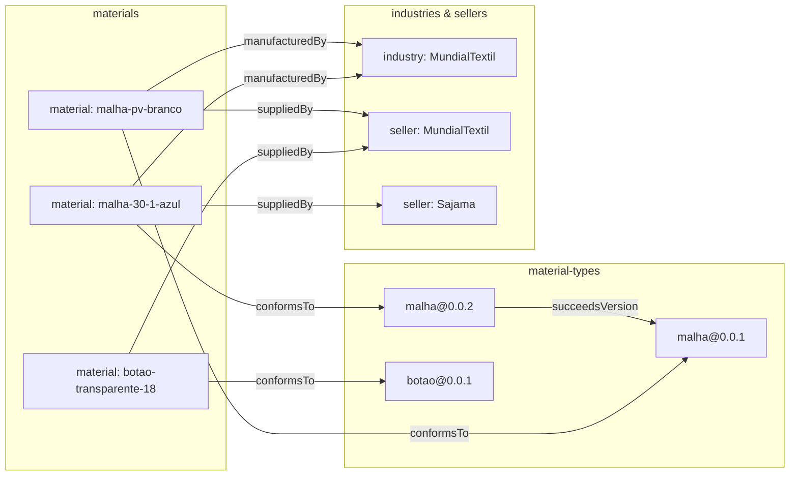
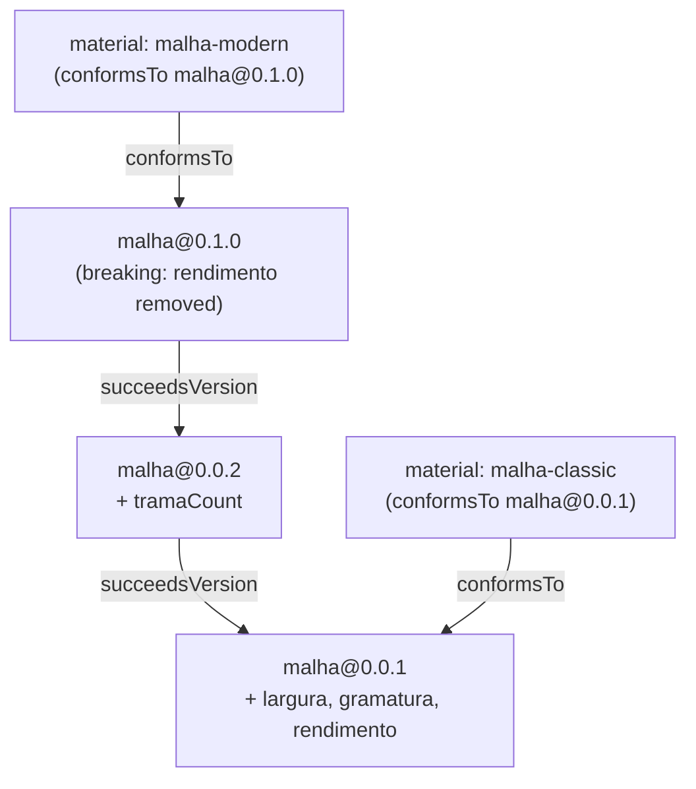
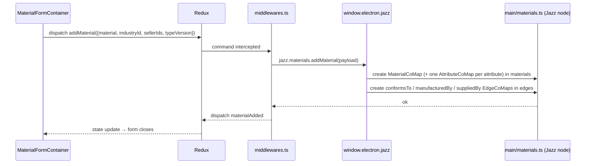

# Materials — graph semantics

Materials are persisted as a **graph on the current workspace's Jazz node**, not as a flat list. This document defines the node/edge taxonomy, the Jazz storage layout, schema versioning rules, and how each Redux action mutates the graph.

For the higher-level module architecture see [overview.md](./overview.md).

## Why a graph

- Models real relationships (a material is supplied by N sellers, manufactured by an industry, conforms to one *version* of a material type).
- Reuses [`kernel/modules/Graphs/searchAlgs`](../../../../kernel/modules/Graphs/searchAlgs) (bfs / dfs / dijkstra) for relational queries without bespoke selectors.
- Aligns with the rest of Klippel's data model — like Composer, the catalog lives on the workspace's Jazz node, though Materials stores **every node, edge, and attribute as its own CoValue** (Composer packs a whole model into one atomic `graphJson`); see [Jazz storage layout](#jazz-storage-layout). A future "catalog-as-graph viewport" is essentially free.
- Schema versioning falls out cleanly: versions are nodes, lineage is edges, no in-place schema mutation.

## Node taxonomy

All nodes conform to `Node` from [`Graphs/interfaces/Node.ts`](../../../../kernel/modules/Graphs/interfaces/Node.ts) (`{id, type, label?, position}`). **Each node is its own Jazz CoMap** — there is no shared graph blob. A material's schema-driven attributes are themselves CoValues, so two users can edit different attributes of the same material concurrently and Jazz merges both writes.

| Node type                    | CoValue                                                  | `id` shape                               | Payload                                                                                                                                                                              |
| ---------------------------- | -------------------------------------------------------- | ---------------------------------------- | ------------------------------------------------------------------------------------------------------------------------------------------------------------------------------------ |
| `material`                   | `MaterialCoMap` — entry in `MaterialCatalogCoMap.materials` | user-supplied slug, unique per workspace | Typed CoMap fields + `attributes` (a record of `AttributeCoMap` cells), `stock` (`StockCoMap`), `composition?`, `caracteristics?`, `externalId?`, `externalURL?`, `description?`, `schemaVersion` |
| `materialType@version`       | `MaterialTypeCoMap` — entry in `.materialTypes`           | `{name}@{version}` (e.g. `malha@0.0.1`)  | `MaterialTypeSchema` from [`materialTypes/state.ts`](../../store/materialTypes/state.ts) as `schemaJson` — atomic, since type versions are immutable (no parallel-edit concern). **A new version is a new entry.** |
| `industry`                   | `OrgNodeCoMap` — entry in `.industries`                  | slug                                     | Typed CoMap fields (`name`, `country?`, `contact?`, …) — each field an independent CRDT register                                                                                      |
| `seller`                     | `OrgNodeCoMap` — entry in `.sellers`                     | slug                                     | Typed CoMap fields (`name`, `contact?`, `priceList?`, …)                                                                                                                              |
| `attribute-value` *(future)* | —                                                        | —                                        | Reserved for shared-value nodes (e.g. shared color palette). Not built now.                                                                                                           |

## Edge taxonomy

All edges conform to `Edge` from [`Graphs/interfaces/Edge.ts`](../../../../kernel/modules/Graphs/interfaces/Edge.ts) (`{id, type, sourceId, targetId}`). Each edge is its own `EdgeCoMap`, stored in `MaterialCatalogCoMap.edges` — so the `conformsTo` / `manufacturedBy` / `suppliedBy` edges one user adds with a new material never clobber edges another user adds in parallel.

| Edge type                    | source → target                         | Cardinality | Meaning                                                         |
| ---------------------------- | ---------------------------------------- | ----------- | --------------------------------------------------------------- |
| `conformsTo`               | material → materialType@version         | 1:1         | Which schema version the material was authored under.           |
| `manufacturedBy`           | material → industry                     | 1:1         | Replaces the `industry: string` field.                        |
| `suppliedBy`               | material → seller                       | 1:N         | Replaces the `suppliers: string[]` field.                     |
| `succeedsVersion`          | materialType@v(n+1) → materialType@v(n) | 1:1         | Lineage between schema versions; lets the form find the latest. |
| `migrationOf` *(future)* | material → material                     | 1:1         | When a material is re-authored against a newer type version.    |

## Relationship diagramUse mermaid



## Schema versioning lineage



Old materials keep their `conformsTo` edge pointing at the version they were created under. Bumping a type only adds a node + a `succeedsVersion` edge; it never mutates prior data or existing CoValues.

## Jazz storage layout

The catalog hangs off one `MaterialCatalogCoMap`, referenced by `WorkspaceCoMap.materials`. **Every node, edge, and attribute is its own CoValue** — there is no atomic `graphJson` blob. CoSchema additions in [`kernel/modules/Store/schema.ts`](../../../../kernel/modules/Store/schema.ts):

```ts
const NodePosition = co.map({ x: z.number(), y: z.number() });

// One attribute cell — its own CoValue, so users editing different
// attributes of the same material never collide. Object-typed attributes
// recurse through `children`.
export const AttributeCoMap = co.map({
  key: z.string(),
  valueJson: z.optional(z.string()),                          // JSON-encoded leaf value
  get children() {
    return co.optional(co.record(z.string(), AttributeCoMap)); // object attributes
  },
});

// stock — its own CoMap; `amount` / `unit` are independent CRDT registers.
export const StockCoMap = co.map({ amount: z.number(), unit: z.string() });

// A material node.
export const MaterialCoMap = co.map({
  id: z.string(),
  type: z.string(),
  label: z.optional(z.string()),
  position: NodePosition,
  attributes: co.record(z.string(), AttributeCoMap),          // schema-driven, per-attribute CRDTs
  stock: StockCoMap,
  composition: co.optional(co.record(z.string(), AttributeCoMap)),
  caracteristics: co.optional(co.record(z.string(), AttributeCoMap)),
  externalId: z.optional(z.string()),
  externalURL: z.optional(z.string()),
  description: z.optional(z.string()),
  schemaVersion: z.string(),
  updatedAt: z.number(),
});

// A material-type schema version. Immutable once written — no parallel-edit
// concern, so its body stays an atomic JSON string.
export const MaterialTypeCoMap = co.map({
  id: z.string(),            // `${name}@${version}`
  schemaJson: z.string(),
});

// industry / seller nodes — fixed (non-schema-driven) fields, so plain
// CoMap fields suffice; each field is its own CRDT register.
export const OrgNodeCoMap = co.map({
  id: z.string(),
  type: z.string(),          // "industry" | "seller"
  label: z.optional(z.string()),
  position: NodePosition,
  name: z.string(),
  country: z.optional(z.string()),
  contact: z.optional(z.string()),
  updatedAt: z.number(),
});

// One edge — its own CoValue, so parallel structural edits merge.
export const EdgeCoMap = co.map({
  id: z.string(),
  type: z.string(),
  sourceId: z.string(),
  targetId: z.string(),
});

export const MaterialCatalogCoMap = co.map({
  materials:     co.record(z.string(), MaterialCoMap),
  materialTypes: co.record(z.string(), MaterialTypeCoMap),
  industries:    co.record(z.string(), OrgNodeCoMap),
  sellers:       co.record(z.string(), OrgNodeCoMap),
  edges:         co.record(z.string(), EdgeCoMap),
});

// WorkspaceCoMap gains (optional, for backward compatibility with
// workspaces created before Materials shipped):
//   materials: co.optional(MaterialCatalogCoMap)
```

The graph index (`{nodes, edges, adjacencyList}`) the slice consumes is **derived in memory** by `loadMaterials` — node entries come from the four node records, edges from the `edges` record, and `adjacencyList` is computed by walking the edges. Adjacency is never persisted.

### Why per-CoValue

Composer's `jazz-performance.md` favours atomic-string graphs (`graphJson`) over per-node CRDTs because a model is loaded and saved as a whole and per-node history bloats. The Materials catalog has the opposite profile:

- It is long-lived shared state, not a document one person opens at a time.
- Edits are small and frequent (a stock number, one attribute) and arrive from multiple users.
- An atomic blob would force an `EditLease` (as `ModelCoMap` has) and serialize every catalog edit behind a single writer.

Per-node / per-attribute CoValues make each edit a CRDT merge: no lease, no clobbering, concurrent attribute edits on the same material both land. The cost — more CoValues, more per-cell history — is accepted, and bounded by the explicit-save UX (no keystroke autosave).

## Schema versioning rules

1. **A new schema version is a new node** (`<type>@<version>`), written as a new `MaterialTypeCoMap` entry in `materialTypes`. Existing entries are immutable.
2. Creating a material auto-pins it to the type's `latestSchema` and writes a `conformsTo` edge.
3. When editing an existing material whose `conformsTo` points at an older version:
   - Default: keep editing against the **old** schema (no surprises).
   - Form shows a passive banner *"Newer schema vN available — Migrate"*. The migration action is deferred; when implemented it would create a `migrationOf` edge to a new material node authored against the latest schema.
4. Grid columns and fuzzy-search keys are driven by `latestSchema`'s `selector.principal` / `selector.extra` per type, falling back to the material's own pinned version for display.

## Persistence operations

Renderer-side commands run in [`store/materials/middlewares.ts`](../../store/materials/middlewares.ts); the actual CoValue reads/writes happen in the main process ([`main/materials.ts`](../../main/materials.ts)) over the Jazz IPC surface (`window.electron.jazz.*`). Cold-start: if `WorkspaceCoMap.materials` is absent, the main process lazily creates an **empty** `MaterialCatalogCoMap`. There is no hard-coded fixture seed; the catalog is populated either by user edits or by importing the bundled `public/materials/materials.xlsx` fixture via the import UI (renderer-driven; the importer dispatches the same `addMaterial` / `registerMaterialTypeVersion` actions a user would).



Because every cell is an independent CoValue, a mutation touches only the cells it changes — no read-modify-write of a shared blob — so concurrent edits from different peers merge without a lock.

### Per-action behavior

- **`loadMaterials`** — read the `MaterialCatalogCoMap`: iterate the `materials` / `materialTypes` / `industries` / `sellers` records for nodes and the `edges` record for edges, derive `adjacencyList` in memory, and build `MaterialsState` for the slice.
- **`addMaterial({ material, industryId, sellerIds, typeVersion })`** — create a `MaterialCoMap` (with one `AttributeCoMap` per attribute and a `StockCoMap`) in `materials` → create `conformsTo` + `manufacturedBy` + `suppliedBy` `EdgeCoMap`s in `edges` → dispatch `materialAdded`. **Auto-creates** any referenced industry/seller `OrgNodeCoMap` that doesn't exist yet.
- **`updateMaterial({ id, patch, industryId?, sellerIds? })`** — mutate the affected fields on the material's `MaterialCoMap` in place: each changed scalar field (`type`, `label`, `externalId`, `externalURL`, `description`, `schemaVersion`) is set via `$jazz.set`; `stock.amount` and `stock.unit` are written per cell on the `StockCoMap`; `updatedAt` is stamped. If `type` changed → re-point the `conformsTo` `EdgeCoMap`'s `targetId` to the new type's `latestSchema`. If `industryId`/`sellerIds` changed → add/remove the corresponding `EdgeCoMap`s. Dispatch `materialUpdated`. **Current limitation:** the schema-driven `attributes` / `composition` / `caracteristics` records are still replaced wholesale (one `$jazz.set("attributes", …)` per save). Per-cell diffing — so concurrent edits to two different attributes of the same material merge instead of clobbering — is queued as a follow-up.
- **`updateMaterialStock({ id, stock })`** — narrow write: set `amount`/`unit` on the material's `StockCoMap` → dispatch `materialStockUpdated`. Used when the Update form touched only `stock`.
- **`deleteMaterial({ id })`** — delete the material's entry from `materials` and every incident `EdgeCoMap` from `edges`, dispatch `materialDeleted`. Orphan industry/seller nodes are kept (might be reused).
- **`registerMaterialTypeVersion({ name, schema })`** — create a `MaterialTypeCoMap` in `materialTypes` keyed `<name>@<version>` (refuses to overwrite an existing version), create a `succeedsVersion` `EdgeCoMap` if a predecessor exists, dispatch `materialTypeVersionRegistered`.

## Workspace rehydration

Each workspace has its own Jazz node; switching workspaces re-resolves it (see the [Jazz foundation change doc](../../../../kernel/modules/Store/docs/changes/2026-05-16-932980-jazz-foundation-and-models-migration.md)). The Materials slice has two refresh paths:

1. **Session cache rehydration.** `defineRehydration("materials/rehydrated", loadFromWorkspace)` restores the per-workspace cached snapshot from `.session/Materials/materials/*.json` so the grid renders before the first IPC round-trip.
2. **Jazz catalog refetch.** On `workspaceSelected` (and on the system-tray Refresh action) the middleware dispatches `loadMaterialsCatalog()`, which calls `window.electron.jazz.materials.load()` and overwrites the slice with the authoritative catalog. Same pattern Converter uses for its conversion graph.

## Invariants

- Every `material` node has exactly one `conformsTo` outgoing edge.
- Every `material` node has at most one `manufacturedBy` outgoing edge.
- Every `material` node has zero or more `suppliedBy` outgoing edges (no duplicates against the same seller).
- `MaterialTypeCoMap` entries are immutable once written; new versions add new entries.
- `adjacencyList` is derived in memory from the `edges` record on load and after every mutation; it is never persisted.
- `id` collisions across material types are rejected at write time (a material's `id` is the unique key into `MaterialCatalogCoMap.materials`).

## Reused interfaces

- [`Node`](../../../../kernel/modules/Graphs/interfaces/Node.ts), [`Edge`](../../../../kernel/modules/Graphs/interfaces/Edge.ts)
- `defineRehydration` and the `window.electron.jazz.*` IPC surface from [`kernel/modules/Store`](../../../../kernel/modules/Store); CoSchema (`MaterialCatalogCoMap` & friends) added to [`Store/schema.ts`](../../../../kernel/modules/Store/schema.ts)
- `MaterialTypeSchema`, `AttributeTypes` from [`materialTypes/state.ts`](../../store/materialTypes/state.ts)
