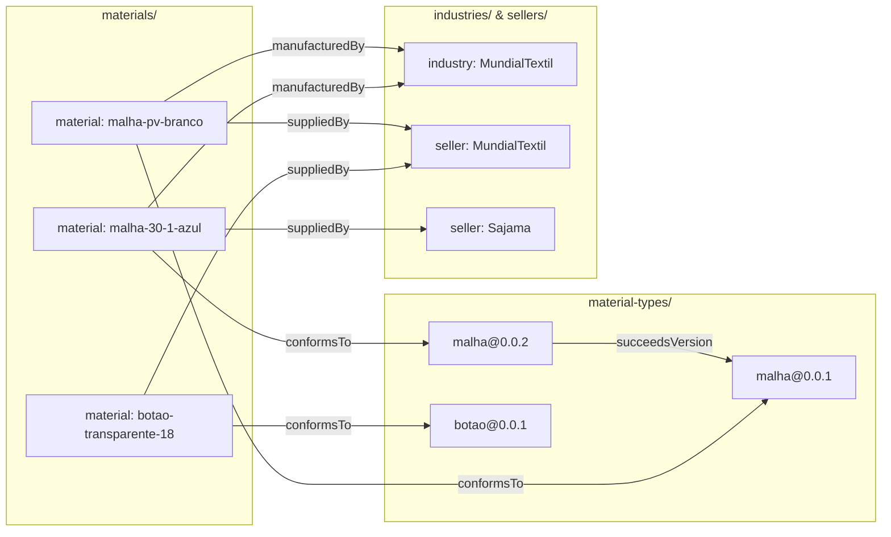
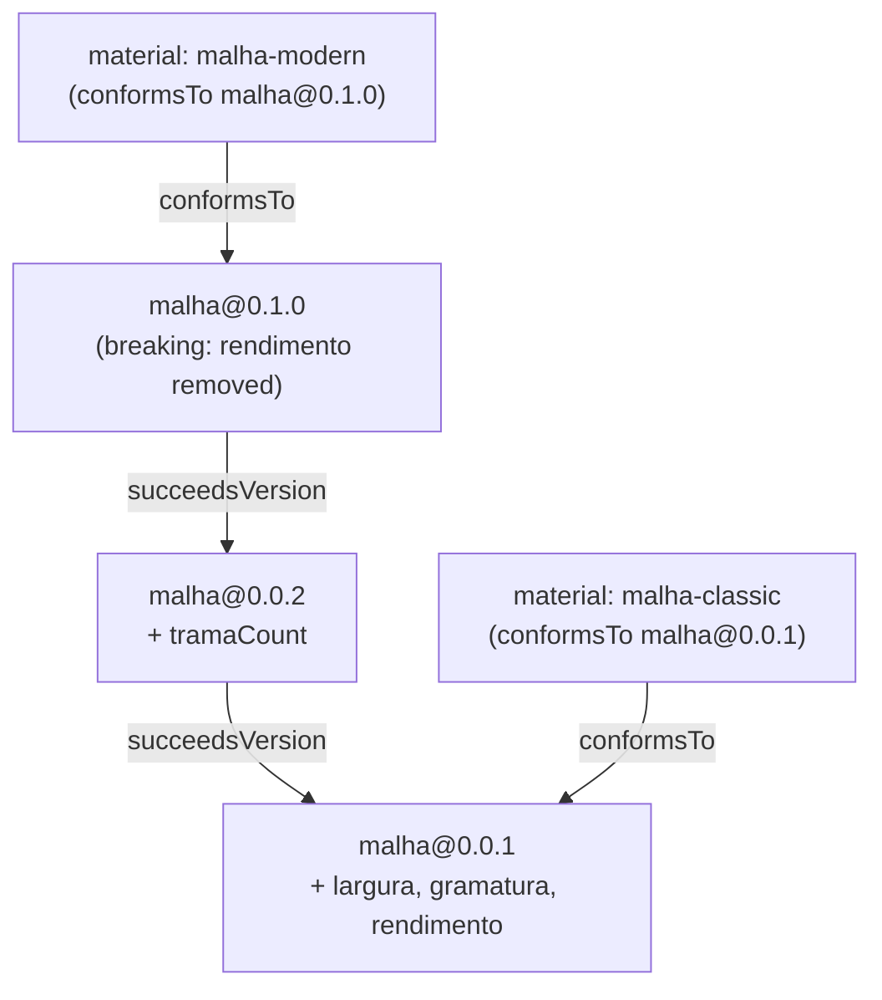
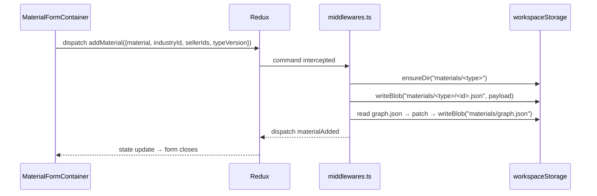

# Materials — graph semantics

Materials are persisted as a **graph in the current workspace**, not as a flat list. This document defines the node/edge taxonomy, the on-disk layout, schema versioning rules, and how each Redux action mutates the graph.

For the higher-level module architecture see [overview.md](./overview.md).

## Why a graph

- Models real relationships (a material is supplied by N sellers, manufactured by an industry, conforms to one *version* of a material type).
- Reuses [`kernel/modules/Graphs/searchAlgs`](../../../../kernel/modules/Graphs/searchAlgs) (bfs / dfs / dijkstra) for relational queries without bespoke selectors.
- Aligns with the rest of Klippel's data model — Composer also persists models as `graph.json`. A future "catalog-as-graph viewport" is essentially free.
- Schema versioning falls out cleanly: versions are nodes, lineage is edges, no in-place schema mutation.

## Node taxonomy

All nodes conform to `Node` from [`Graphs/interfaces/Node.ts`](../../../../kernel/modules/Graphs/interfaces/Node.ts) (`{id, type, label?, position}`). Heavy data lives in a per-node JSON file referenced by id; the graph file only carries the index + edges so it stays small.

| Node type | Folder | `id` shape | Payload |
|---|---|---|---|
| `material` | `materials/{materialType}/{id}.json` | user-supplied slug, unique per workspace | `{ attributes, composition?, caracteristics?, stock, externalId?, externalURL?, images?, description?, schemaVersion }` |
| `materialType@version` | `material-types/{name}/{version}.json` | `{name}@{version}` (e.g. `malha@0.0.1`) | `MaterialTypeSchema` from [`materialTypes/state.ts`](../../store/materialTypes/state.ts). **A new version is a new node.** Existing version files are immutable. |
| `industry` | `industries/{id}.json` | slug | `{ name, country?, contact?, ... }` |
| `seller` | `sellers/{id}.json` | slug | `{ name, contact?, priceList? }` |
| `attribute-value` *(future)* | — | — | Reserved for shared-value nodes (e.g. shared color palette). Not built now. |

## Edge taxonomy

All edges conform to `Edge` from [`Graphs/interfaces/Edge.ts`](../../../../kernel/modules/Graphs/interfaces/Edge.ts) (`{id, type, sourceId, targetId}`) and live in a single `materials/graph.json`.

| Edge type | source → target | Cardinality | Meaning |
|---|---|---|---|
| `conformsTo` | material → materialType@version | 1:1 | Which schema version the material was authored under. |
| `manufacturedBy` | material → industry | 1:1 | Replaces the `industry: string` field. |
| `suppliedBy` | material → seller | 1:N | Replaces the `suppliers: string[]` field. |
| `succeedsVersion` | materialType@v(n+1) → materialType@v(n) | 1:1 | Lineage between schema versions; lets the form find the latest. |
| `migrationOf` *(future)* | material → material | 1:1 | When a material is re-authored against a newer type version. |

## Relationship diagram



## Schema versioning lineage



Old materials keep their `conformsTo` edge pointing at the version they were created under. Bumping a type only adds a node + a `succeedsVersion` edge; it never mutates prior data or files.

## On-disk layout

```
workspaces/<ws>/
├── materials/
│   ├── graph.json                 # index of nodes + edges + adjacencyList
│   ├── malha/
│   │   ├── malha-pv-branco.json
│   │   └── malha-30-1-azul.json
│   ├── botao/
│   │   └── botao-transparente-18.json
│   └── ... (folder per materialType)
├── material-types/
│   ├── malha/
│   │   ├── 0.0.1.json
│   │   └── 0.0.2.json
│   └── botao/
│       └── 0.0.1.json
├── industries/
│   └── MundialTextil.json
└── sellers/
    ├── MundialTextil.json
    └── Sajama.json
```

`materials/graph.json` shape (mirrors [Composer GraphState](../../../Composer/store/models/middlewares.ts)):

```ts
{
  id: "materials-graph",
  nodes: { [nodeId]: Node },                                  // light index
  edges: { [edgeId]: Edge },
  adjacencyList: { [nodeId]: { inputs: EdgeId[]; outputs: EdgeId[] } }
}
```

## Schema versioning rules

1. **A new schema version is a new node** (`<type>@<version>`), written to `material-types/{name}/{newVersion}.json`. The old version file is immutable.
2. Creating a material auto-pins it to the type's `latestSchema` and writes a `conformsTo` edge.
3. When editing an existing material whose `conformsTo` points at an older version:
   - Default: keep editing against the **old** schema (no surprises).
   - Form shows a passive banner *"Newer schema vN available — Migrate"*. The migration action is deferred; when implemented it would create a `migrationOf` edge to a new material node authored against the latest schema.
4. Grid columns and fuzzy-search keys are driven by `latestSchema`'s `selector.principal` / `selector.extra` per type, falling back to the material's own pinned version for display.

## Persistence operations

Implemented in [`store/materials/middlewares.ts`](../../store/materials/middlewares.ts). All writes use `workspaceStorage` from [`kernel/modules/Store/workspaceScope.ts`](../../../../kernel/modules/Store/workspaceScope.ts). Cold-start bootstrap: if `materials/graph.json` is missing, derive nodes/edges/payloads from the existing hard-coded fixtures and write them out once, so dev workflows keep working.



### Per-action behavior

- **`loadMaterials`** — read `materials/graph.json`; for each `material` node, read its payload file; for each referenced `materialType@version` / `industry` / `seller`, read its payload file; build `MaterialsState` for the slice.
- **`addMaterial({ material, industryId, sellerIds, typeVersion })`** — `ensureDir("materials/<type>")` → `writeBlob` payload → update graph (add material node + `conformsTo` + `manufacturedBy` + `suppliedBy` edges + adjacency) → `writeBlob` graph.json → dispatch `materialAdded`. **Auto-creates** any referenced industry/seller node that doesn't exist (stub payload file).
- **`updateMaterial({ id, patch, industryId?, sellerIds? })`** — read existing payload, merge `patch`, write back. If `type` changed → `moveFile` to the new folder, rewrite the node's `type` in `graph.json`, update `conformsTo` to the new type's `latestSchema`. If `industryId`/`sellerIds` changed → diff and patch the corresponding edges. Dispatch `materialUpdated`.
- **`updateMaterialStock({ id, stock })`** — narrow write: re-serialize just the material's payload (no graph touch) → dispatch `materialStockUpdated`. Used by inline grid edits to keep them cheap.
- **`deleteMaterial({ id })`** — `deleteFile` payload, remove the node and all incident edges from `graph.json`, dispatch `materialDeleted`. Orphan industry/seller nodes are kept (might be reused).
- **`registerMaterialTypeVersion({ name, schema })`** — `writeBlob("material-types/<name>/<version>.json", schema)` (refuses to overwrite an existing version), adds node + optional `succeedsVersion` edge, dispatches `materialTypeVersionRegistered`.

## Workspace rehydration

All writes route through `workspaceStorage`, which re-resolves the workspace folder on every operation (see [`workspaceScope.ts`](../../../../kernel/modules/Store/workspaceScope.ts)). The Materials slice registers a rehydrator via `defineRehydration("materials/rehydrated", loadFromWorkspace)`; on workspace switch the Store middleware fires it and the slice swaps state without a page reload.

## Invariants

- Every `material` node has exactly one `conformsTo` outgoing edge.
- Every `material` node has at most one `manufacturedBy` outgoing edge.
- Every `material` node has zero or more `suppliedBy` outgoing edges (no duplicates against the same seller).
- `materialType@version` payload files are immutable once written; new versions add new files.
- `graph.json`'s `adjacencyList` is kept in sync with `edges` on every mutation (single transaction inside the middleware effect).
- `id` collisions across material types are rejected at write time (`materials/{anyType}/<id>.json` must be unique).

## Reused interfaces

- [`Node`](../../../../kernel/modules/Graphs/interfaces/Node.ts), [`Edge`](../../../../kernel/modules/Graphs/interfaces/Edge.ts)
- [`workspaceStorage`, `defineRehydration`](../../../../kernel/modules/Store/workspaceScope.ts)
- `MaterialTypeSchema`, `AttributeTypes` from [`materialTypes/state.ts`](../../store/materialTypes/state.ts)
