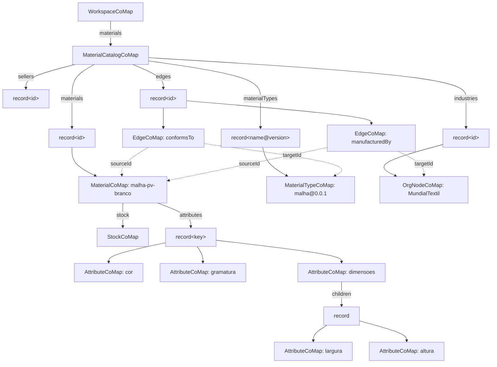
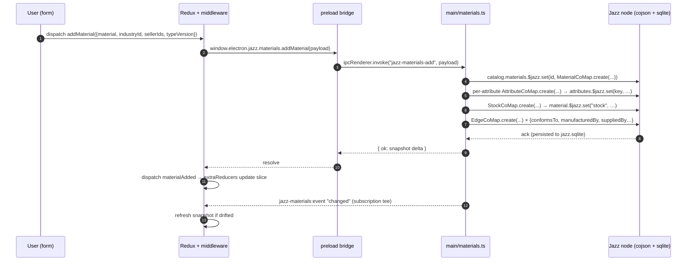
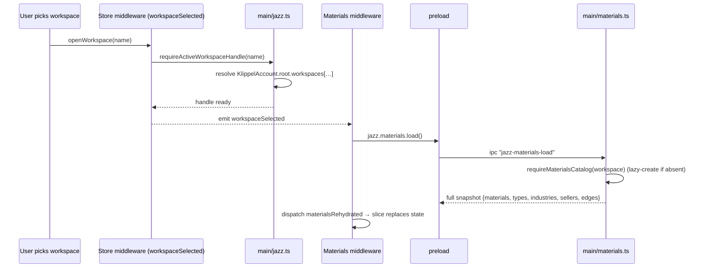
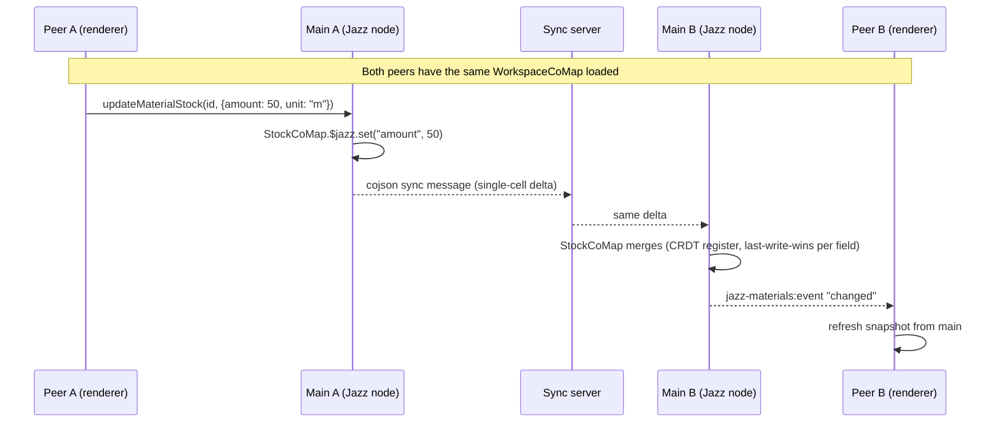

# Materials — Jazz storage & sync

> **History — storage and sync have moved.** The layout below is how this
> module worked on Jazz until 2026-08-30. Rows now live in SQLite and reach
> other peers as `crsql_changes` over our own relay
> ([p2p-sqlite/overview.md](../../../../../electron/main/docs/p2p-sqlite/overview.md)); the write paths and the "how an edit travels"
> sections here describe the old machinery. What is still current is the
> *shape* of the data and the IPC contract, which the migration preserved.
> See [jazz-is-dead.md](../../../../docs/jazz-is-dead.md) before writing code against it.

How the materials catalog is laid out on Jazz, how a single edit travels from a click to other peers, and where the seams live.

For the higher-level module shape see [architecture/overview.md](./architecture/overview.md). For the node/edge taxonomy see [architecture/graph-semantics.md](./architecture/graph-semantics.md). For the kernel Jazz foundation (account, workspace, IPC) see [`kernel/modules/Store/docs/changes/2026-05-16-932980-jazz-foundation-and-models-migration.md`](../../../../kernel/modules/Store/docs/changes/2026-05-16-932980-jazz-foundation-and-models-migration.md).

## TL;DR

- The catalog hangs off `WorkspaceCoMap.materials` as a `MaterialCatalogCoMap`.
- **Every node, every edge, and every schema-driven attribute is its own CoValue** (no `graphJson` blob, no `EditLease`). Concurrent edits to different cells merge as CRDTs.
- Renderer talks to the catalog only through `window.electron.jazz.materials.*`. The main process owns the Jazz node; the renderer keeps a derived snapshot in Redux.
- Workspace switch → re-resolve the new workspace's catalog → push a fresh snapshot to the slice.
- Sync between peers is the kernel's responsibility (websocket relay, optional). Catalog CoValues ride that same channel — no Materials-specific sync code.

## Data layout

```
KlippelAccount.root
└── workspaces: list<WorkspaceCoMap>
    └── WorkspaceCoMap
        ├── metadata        : WorkspaceMetadata
        ├── models          : record<id, ModelCoMap>          ← Composer
        ├── modelSummaries  : record<id, ModelSummary>        ← Composer projection
        └── materials       : MaterialCatalogCoMap            ← THIS MODULE
            ├── materials     : record<id, MaterialCoMap>
            │     ├─ id, type, label, position, schemaVersion, updatedAt
            │     ├─ stock          : StockCoMap { amount, unit }
            │     ├─ attributes     : record<key, AttributeCoMap>
            │     ├─ composition?   : record<key, AttributeCoMap>
            │     └─ caracteristics?: record<key, AttributeCoMap>
            ├── materialTypes : record<id, MaterialTypeCoMap>  (id = "name@version")
            ├── industries    : record<id, OrgNodeCoMap>
            ├── sellers       : record<id, OrgNodeCoMap>
            └── edges         : record<id, EdgeCoMap>          (conformsTo / manufacturedBy / suppliedBy / succeedsVersion)
```

`AttributeCoMap` recurses through an optional `children` record so object-typed attributes (the schema's `object` kind) stay per-cell as well.

Diagram:



The dotted arrows are not Jazz refs — `sourceId` / `targetId` are plain string fields. Adjacency is rebuilt in memory by `loadMaterialsCatalog` and never persisted ([graph-semantics.md → Invariants](./architecture/graph-semantics.md#invariants)).

## Why per-CoValue (vs Composer's `graphJson`)

| Concern                 | Composer `ModelCoMap.graphJson`       | Materials catalog                       |
| ----------------------- | ------------------------------------- | --------------------------------------- |
| Lifetime                | Document opened by one editor at a time | Long-lived shared state                 |
| Edit cadence            | Many local changes, one explicit save | Small, frequent, multi-user            |
| Write coordination      | `EditLease` (single-writer)           | None — CRDTs merge per cell             |
| History bloat           | Bounded (one entry per save)          | Higher — accepted; mitigated by explicit-save form UX |
| Storage shape           | One atomic JSON string                | One CoValue per node / edge / attribute |

A keystroke in the Material form does **not** write to Jazz. Writes happen only on form submit, which keeps per-cell history within sane bounds while still benefiting from CRDT merge on concurrent saves.

## Process boundary

```
┌─ Renderer (React + Redux) ─────────────────────────────────────┐
│                                                                │
│  Components ──dispatch──▶ Redux command actions                │
│       ▲                       │                                │
│       │ events                ▼                                │
│       └───── store/materials/slice.ts (extraReducers)          │
│                               ▲                                │
│                               │ event dispatch                 │
│              store/materials/middlewares.ts                    │
│                               │                                │
│                               ▼                                │
│             window.electron.jazz.materials.*  (preload bridge) │
└───────────────────────────────┬────────────────────────────────┘
                                │  IPC (contextBridge)
┌───────────────────────────────▼────────────────────────────────┐
│  Main process                                                  │
│                                                                │
│  electron/main/jazz-hooks.ts   ── ipcMain.handle("jazz-...")   │
│             │                                                  │
│             ▼                                                  │
│  system/modules/Materials/main/materials.ts                    │
│             │                                                  │
│             ▼                                                  │
│  Jazz node (KlippelAccount) ── cojson + SQLite (jazz.sqlite)   │
│             │                                                  │
│             └── websocket peer (optional, when syncOptIn)      │
└────────────────────────────────────────────────────────────────┘
```

- **Renderer** never touches a CoValue. It reads the slice's plain-JSON snapshot and dispatches commands.
- **Preload** (`webapp/electron/preload/jazz.ts`) is the only surface the renderer sees: `window.electron.jazz.materials.load / addMaterial / updateMaterial / updateMaterialStock / deleteMaterial / registerMaterialTypeVersion / seed / subscribe`.
- **Main process** owns the workspace's `KlippelAccount`, the SQLite-backed cojson storage, and every CoValue mutation. It also pushes change notifications back to renderers via `webContents.send("jazz-materials:event", …)`.

## Lifecycle: write path (add material, single peer)



Two return paths converge on the same slice: the **promise** carries the operation's outcome, and the **subscription event** keeps every renderer in the app in sync even when the change originated elsewhere (another window, another peer).

## Lifecycle: workspace switch



`requireMaterialsCatalog` is the lazy bootstrap: if `WorkspaceCoMap.materials` is `undefined` (older workspace, or first ever open), it creates an empty `MaterialCatalogCoMap` under the workspace's existing Jazz group. **No cross-workspace data leaks** — every catalog inherits the group ACL of its parent workspace.

## Multi-peer sync

The catalog rides the same WebSocket relay path as `ModelCoMap` (see the Composer jazz doc). The Materials module adds **zero** sync code — it just reuses the kernel's peer manager.



Because the unit-of-write is one `StockCoMap` field, two peers that simultaneously edit `amount` on different materials never conflict. Two peers editing `amount` on the **same** material resolve last-write-wins on the register (cojson timestamp + writer-id). Two peers editing **different attributes** of the same material (e.g. `cor` vs `gramatura`) both land.

### What is NOT yet safe under sync

- **No receive-validator.** A peer with write access on the group could push malformed CoValues. Tracked in foundation Phase 6 (see [collaborative-jazz-multi-peer-harness change doc](../../../../kernel/modules/Store/docs/changes/2026-05-18-b5c2fb-collaborative-jazz-multi-peer-harness.md)). Do not flip `syncOptIn=true` on a workspace whose catalog matters until then.
- **`attributes` is currently rewritten as a whole record on `updateMaterial`** (see `main/materials.ts` — comment: "Per-attribute CRDT preservation is a future refinement"). This temporarily defeats the per-attribute merge benefit for the *attributes* record specifically. Per-cell diffing is queued as a follow-up. `stock`, scalar `MaterialCoMap` fields, `OrgNodeCoMap` fields, and edges are unaffected and remain per-cell.

## Diagnostics

Every catalog mutator in `main/materials.ts` tees a synthetic log entry into [`electron/main/jazzLogBuffer.ts`](../../../../../electron/main/jazzLogBuffer.ts), the same ring buffer fed by cojson's logger. The system-tray `SyncLogsIndicator` and `PeersIndicator` surface those entries — including catalog activity — without needing a separate Materials log path. See [Layout / SystemTray sync diagnostics change doc](../../../../kernel/modules/Layout/docs/changes/2026-05-23-d48a48-system-tray-sync-diagnostics.md).

## Failure modes & invariants worth remembering

- **Dispatch after IPC.** Command middlewares (`addMaterial`, `updateMaterial`, `updateMaterialStock`, `deleteMaterial`) `await` the main-process call before dispatching the matching event with the server-confirmed payload. If the main process rejects (id collision, validation), the slice never sees the bad row. `registerMaterialTypeVersion` is the exception — it dispatches optimistically because the schema selectors need the new version available immediately; an IPC failure there is logged and reconciled on the next catalog load.
- **`MaterialTypeCoMap` is immutable.** `registerMaterialTypeVersion` refuses overwrite; a new version is a new entry plus a `succeedsVersion` edge.
- **Adjacency is derived.** Never `$jazz.set` an `adjacencyList`; recompute from the `edges` record after every reload.
- **Material `id` is the key into the record.** Renaming a material is a delete + create + edge re-wire — there is no rename op.
- **All writes go through IPC.** No file I/O for the catalog, no direct CoValue mutation from the renderer. The Jazz node lives only in the main process.
