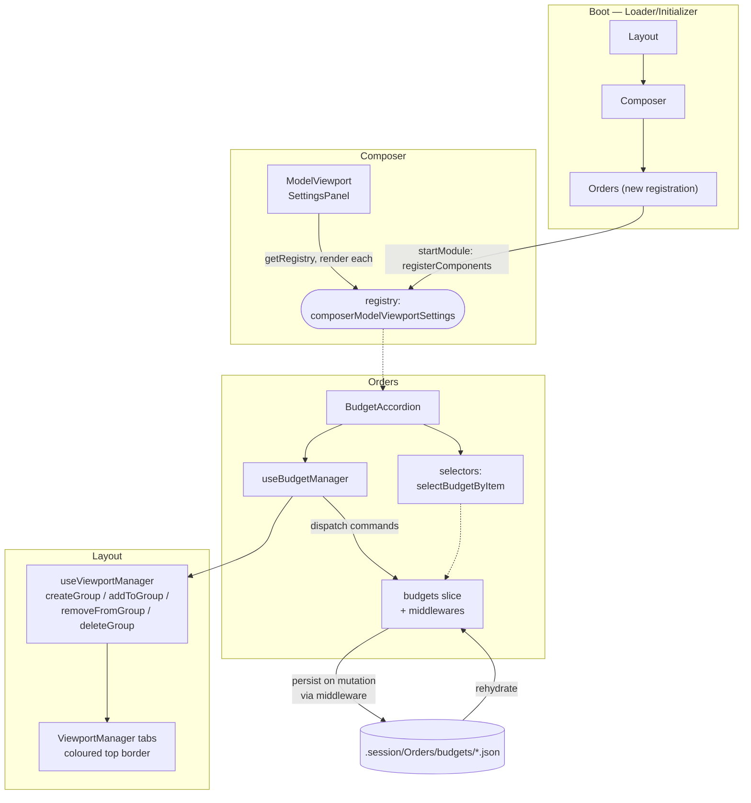
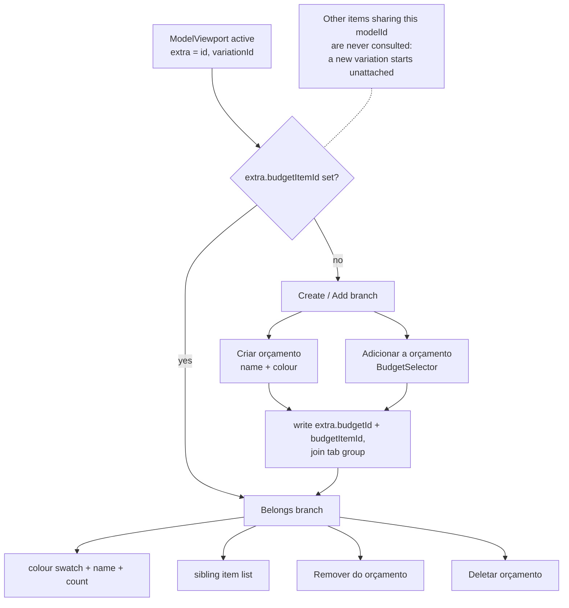
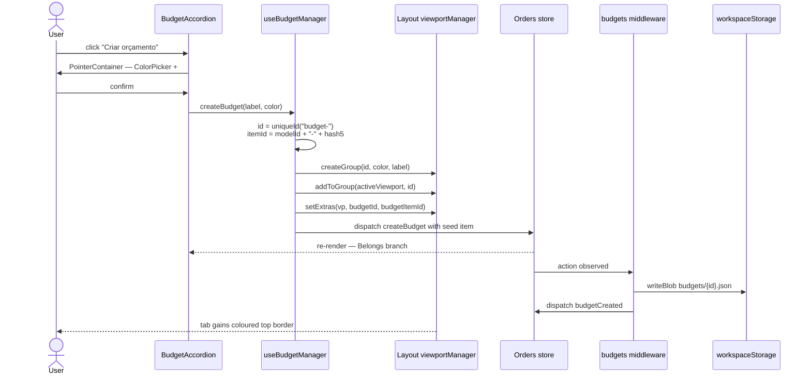
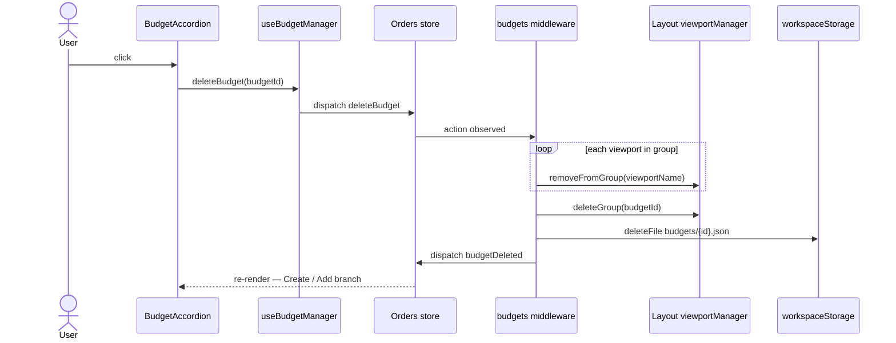

## Context

The Orders module exists but is **entirely orphaned**: it is not listed in
`kernel/modules/Loader/components/Initializer.tsx`, so its reducer, middlewares
and components never load. Nothing in the app renders `BudgetFloatingButton`.

The wiring it does contain is broken against the current Composer:

- `hooks/useBudgetManager.ts` calls `composerModule.hooks.useComposition(...)`
  and `composer.actions.addToBudget(...)`. `useComposition` is a **stub** in
  `Composer/index.ts` that returns `{ state: selector(null), actions: {} }` —
  so `addToBudget` is `undefined` and the call would throw.
- The unit of work in Composer is no longer a "composition"; it is a
  **model variation** opened in a `ModelViewport`
  (`useModelsManager.openModel` → viewport `extra = { id: modelId, variationId, view }`).
- `store/slice.ts` forwards only `createBudget` to the budgets sub-slice, so
  `deleteBudget` (and every future budget action) is silently dropped.
- `store/budgets/slice.ts` `deleteBudget` deletes `.session/Orders/budgets/${state.id}.js`
  — wrong extension, and `state` is the whole budget map, so `state.id` is
  `undefined`. Budgets are also only persisted on `saveSession`, never on create.

The desired behaviour:

1. A user can **create a budget** with a name and a colour. Creating one also
   creates a viewport tab group carrying that colour, and adds the currently
   open model to it as the budget's first item.
2. A user can **add an item to an existing budget**; the item's tab joins that
   budget's group.
3. When the open item **belongs to a budget**, the `Orçamento` accordion shows
   the budget (colour, name, sibling items). When it does not, the accordion
   shows the **Criar orçamento** / **Adicionar a orçamento** buttons.

## Change

### 0. Shape of the implementation

Module wiring — the dependency direction is `Orders → Composer → Layout`, so
Composer never imports Orders; the accordion reaches the SettingsPanel through
a component registry:



Which branch the accordion renders, resolved on every render of the active
`ModelViewport`:



Create-budget, end to end — note the tab group is created before the item, and
persistence happens in the middleware, not the reducer:



Delete-budget unwinds it in the reverse order — `removeFromGroup` per member
viewport, then `deleteGroup`, then the budget JSON:



### 1. Item identity — `modelId` + 5-digit hash

A budget item is a *line* in a budget, not a live viewport. Its id is
`` `${modelId}-${hash5}` `` where `hash5` is a 5-character lowercase hex suffix
generated once, when the model is added to a budget, and persisted with the
budget.

Rationale: `variationId` is `uniqueId("variation-instance-")`, regenerated on
every `openModel`, so it cannot survive a restart. `modelId` alone would forbid
the same model appearing in two budgets (or twice in one). `modelId-hash5` is
stable across restarts, addressable, and unique per line.

### 2. State shape — `store/state.ts`

```ts
export type BudgetItemState = {
  itemId: string;   // `${modelId}-${hash5}`
  modelId: string;
  label: string;    // model name captured at add time
  addedAt: number;
  grades?: { label: string; amount: number }[]; // the size curve — and the
                          // line's quantity, summed by `utils/quantity.ts`
  unitCost?: number;      // cost per produced unit, snapshotted on add
  unitMinutes?: number;   // production minutes per unit, snapshotted on add
  costCapturedAt?: number;
}

export type BudgetState = {
  id: string;            // `budget-<n>`
  label: string;
  color: string;         // NEW — mirrored onto the viewport group
  viewportGroup: string; // === id
  items: { [itemId: string]: BudgetItemState };  // NEW
  createdAt: number;     // NEW — stable ordering in the selector
}
```

`color` is duplicated on the budget rather than read back through
`getViewportGroups[...]` (as `BudgetSelector` does today) so budget rendering
never depends on Layout session state having rehydrated first — today
`vpGroups[budget.viewportGroup].color` throws if the group JSON is missing.

### 3. Actions / slice / middleware — `store/budgets/*`

New command/event pairs alongside the existing `createBudget` / `deleteBudget`:

| command | event | payload |
| --- | --- | --- |
| `addItemToBudget` | `itemAddedToBudget` | `{ budgetId, modelId, label, viewportName }` |
| `removeItemFromBudget` | `itemRemovedFromBudget` | `{ budgetId, itemId }` |

`createBudget` payload gains `color` and the seed item.

Reducer fixes required in `store/budgets/slice.ts`:

- Move **all** storage side effects out of the reducer (`storage.deleteFile`,
  `storage.ensureDir` currently run inside `deleteBudget`/`createBudget`).
  Reducers stay pure.
- Fix the delete path: `.session/Orders/budgets/${payload.id}.json`, not
  `${state.id}.js`.
- **Do not persist on mutation.** `.session/` is a point-in-time snapshot: the
  only writer is `store/session.ts` `persistOrdersSession`, reached from the
  `saveSession` listener registered in `kernelCalls`. Budget commands change
  Redux state and emit events; nothing else. See CLAUDE.md and e2e-tests.md §12.
- The save **reconciles**: `pruneBudgetFiles` drops the files of budgets no
  longer in state, so a deletion does not come back on the next rehydrate.
  Deleting a budget deliberately leaves its file until the next save.
- Adopt the rehydration pattern from
  `Layout/store/viewports/groups/slice.ts`: `defineRehydration` +
  `budgetsRehydrated` case, keeping the top-level `await restoreBudgetsSession()`
  initial state for parity with that slice.

`store/slice.ts`: replace the single `builder.addCase(createBudget, …)` with
`builder.addDefaultCase((state, action) => ({ ...state, budgets: budgetSlice.reducer(state.budgets, action) }))`,
mirroring `Layout/store/viewports/slice.ts`. Without this the new actions never
reach the sub-slice.

`store/budgets/middlewares.ts` gains:

- `createBudget` → `viewportManager.createGroup(id, color)` +
  `addToGroup(activeViewport, id)` are today done in the hook; keep them in the
  hook (they need React context), but the middleware persists and emits.
- `deleteBudget` → `removeFromGroup` for every viewport in the group, then
  `deleteGroup` (new Layout capability, see the Layout doc), then delete the
  budget JSON.

### 3b. Where a line's cost comes from

`unitCost` is **snapshotted when the item is added**, from Composer's
`useVariationUnitCost` — the same aggregation the `Custo` accordion shows,
extracted out of `ProcessCostAccordion` into
`Composer/utils/variationUnitCost.ts` so the two cannot drift.

It is a snapshot, not a derivation, because a variation's process graph only
exists in the store while its viewport is open. A budget has to price the lines
whose viewports are closed — deriving on render would blank them. The trade-off
is staleness: `costCapturedAt` records when the number was taken. Re-pricing an
existing line is not implemented (see the open questions).

### 4. Selectors — `store/budgets/selectors.ts`

- `listBudgets()` — existing; return value sorted by `createdAt`.
- `selectBudget(id)` — existing.
- `selectBudgetByItem(itemId)` — the budget holding this item. The *only* way
  membership is resolved; see §5 for why there is no model-keyed equivalent.

### 5. `useBudgetManager` rewrite — `hooks/useBudgetManager.ts`

Drop the `useComposition` / `composer.actions.addToBudget` calls entirely.
The hook reads the **active viewport** and its `extra.id` (the model id):

```ts
createBudget(label: string, color: string): string   // returns budgetId
addToBudget(budgetId: string): string                // returns itemId
removeFromBudget(itemId: string): void
deleteBudget(budgetId: string): void
```

Each mutation also writes `budgetId` / `budgetItemId` into the active
viewport's `extra` via `viewportManager.functions.setExtras`, so the accordion
can resolve membership without a scan on every render.

**Membership is per item, never per model.** The accordion resolves the budget
from `activeVP.extra.budgetItemId` and nothing else. Opening a model produces a
new variation, and a new variation is **not** in any budget until the user
explicitly creates one or adds it — even when other items in some budget share
its `modelId`.

There is deliberately no "budgets containing this model" lookup and no
auto-attach. An earlier revision inferred membership from `modelId` when a
viewport had no linkage (one match → join silently, several → ask). That is
wrong: it put every re-opened variation into a budget the user never chose for
it. Both the inference and the `BudgetCandidates` picker it needed are gone,
along with `selectBudgetsForModel` and `useBudgetManager.attachItem`.

Consequence, and the reason `hash5` exists: adding two variations of the same
model yields two distinct lines (`dJqsazOluu-0837d`, `dJqsazOluu-59831`) that
coexist in one budget.

### 6. `Orçamento` accordion — `components/BudgetAccordion/`

Rendered in the `ModelViewport` **SettingsPanel**, after `Custo`, via the new
Composer settings-panel extension registry (see the Composer doc — Composer
must not import Orders, since `Orders.depends_on = ['Composer']`).

Not in a budget:

- `Criar orçamento` — `id="create-budget"`, `aria-label="create-budget"`.
  `PointerContainer` with `ColorPicker` + `TextField id="budget-name"` and
  `ConfirmAndCloseButton id="create-budget-confirm"`.
  (Renaming `#part-name` → `#budget-name` — the old id was copy-pasted from the
  part form and collides with it.)
- `Adicionar a orçamento` — `id="add-to-budget"`. `PointerContainer` with
  `BudgetSelector` + `ConfirmAndCloseButton id="add-to-budget-confirm"`.
  Disabled, with an explanatory caption, when no budget exists.

In a budget:

- Header row: colour swatch (`budget.color`) + budget name + item count,
  `id="budget-header"`, `data-budget-id`.
- `List` of sibling items, `id="budget-item-list"`. Each row
  (`BudgetItemRow`, `id="budget-item-${itemId}"`, `tabindex="0"` so
  `focusFirstRow` works) shows **name, quantity and total cost**; clicking it
  selects that item's viewport if open.
  - *quantity* — **the sum of the variation's grade amounts** (`GRADUATION`
    nodes), read-only, `data-testid="budget-item-amount"`: a production run is
    graded, so the line is for however many garments the size curve calls for,
    never a number typed in. Derived on render by `utils/quantity.ts`
    `budgetItemAmount`, which falls back to 1 when the variation has no grades
    so an ungraded piece is still quotable. The curve is snapshotted with the
    line and shown beneath it
    ("grade: PP 20 · P 60 · M 90 · G 60 · GG 20") — always, since the quantity
    *is* that sum and the two cannot disagree.
  - *total cost* — `unitCost × quantity`. When `unitCost` is absent the line
    reads **"não precificado"**, never `0.00`: a piece nobody has priced must
    not be indistinguishable from a free one.
  - *production time* — `unitMinutes × quantity`, shown in **days**.
    Snapshotted from the variation's summed `computedTimePerUnit` for the same
    reason as the cost, and absent when the piece has no process, in which case
    the line says "produção: não calculada".

    The minutes → days conversion goes through the **Converter**
    (`minutos249 → dia251`), not through a constant this module invents: a day
    is a unit, and units are defined in the conversion graph alongside every
    other one. `utils/duration.ts` is left holding only the two unit ids and
    the formatting, and `BudgetDetails` resolves the converter once per budget
    rather than per row — `useConverter` in every `BudgetItemRow` would
    multiply across a list that renders every line at once.

    Consequence worth knowing: the graph's `dia251` is a **24-hour calendar
    day** (`hora250 → dia251` is `quantidade / 24`), so the sample's 9 500 min
    reads "6.6 dias", where the previous 8-hour working-day constant gave
    "19.8 dias". The graph is not self-consistent on this point —
    `dia251 → semana253` is `/5`, a five-day *working* week made of
    twenty-four-hour days. Fixing that belongs in the conversion graph, which
    is exactly why this figure now reads from it: the shop-floor day length
    becomes editable data instead of a constant buried in Orders.

    When the graph has no minutes → days path the row falls back to raw
    minutes — a worse unit beats a missing number. The
    `data-budget-item-total-minutes` mirror stays in raw minutes either way, so
    tests assert the quantity rather than the presentation.
  - The row is deliberately lean — a native `input`, `React.memo`, no ripple.
    See §12: a MUI `TextField` per row cost 6× on the render surface.
- `Remover do orçamento` — `id="remove-from-budget"`.
- `Deletar orçamento` — `id="delete-budget"`, behind a `PointerContainer`
  confirm.

`BudgetSelector` is kept and updated to read `budget.color` directly instead of
`vpGroups[budget.viewportGroup].color`.

### 7. Keyboard shortcuts

Per `CLAUDE.md`, every registered shortcut ships with a visible `ShortcutHint`:

| shortcut id | binding | hint |
| --- | --- | --- |
| `Orders/BudgetList/focus` | focus the accordion | `Accordion shortcutHint` prop + `FocusShortcutProvider`, exactly like `Materiais` |
| `Orders/Budget/create` | open the create form | `ShortcutHint` wrapping the `Criar orçamento` button |
| `Orders/Budget/addTo` | open the add form | `ShortcutHint` wrapping the `Adicionar a orçamento` button |

Registered from the accordion component (dynamic — the two action shortcuts
only exist in the not-in-a-budget branch), following
`KeyboardShortcuts/docs/examples/dynamic-shortcuts.tsx`.

### 8. Module registration

- Add Orders to `Initializer.tsx` `extraModules.system`, **after** Composer
  (the settings-panel registry must exist before Orders registers into it —
  `registerComponents` silently drops writes to a registry that does not exist).
- `kernelCalls/index.tsx`: also register `store/middlewares.ts` (the
  `saveSession` listener), which is currently never registered, and register
  `BudgetAccordion` into the Composer settings-panel registry.
- `index.ts`: export `BudgetAccordion` instead of `BudgetFloatingButton`; add
  `createBudget`/`addToBudget` to the module's `hooks` surface.

### 9. Deletions

- `components/BudgetFloatingButton/` (whole directory — index, constants and
  the four button files). `ConvertToOrderButton` and `DeleteBudgetButton` are
  copy-paste of `CreateBudgetButton` and both call `manager.createBudget`;
  nothing is lost. "Converter em pedido" is out of scope and returns with the
  Orders work proper.
- `typings.ts` `BudgetFloatingButtonActions`.

### 10. MCP tools — `mcpTools/`

`createBudget.ts` targets `[aria-label="create-budget"]` and `#part-name`,
both of which move. Rework and extend, following the repo's tool +
`*Shortcut` twin convention (and the "no `page.evaluate` inside tool files"
rule):

- `createBudget` — expand the `Orçamento` accordion, click `#create-budget`,
  fill `#budget-name`, set colour, confirm. New optional `color` param.
- `addToBudget`, `removeFromBudget`, `deleteBudget`.
- `Shortcut` variants for each.
- Register all of them in `electron/main/mcp/index.ts` (currently only
  `createBudgetTool` is wired).

### 11. Tests

`tests/standalone/functionality/budget.e2e.test.ts` — 10 tests, click and
keyboard variants, all passing. Covers:

1. Fresh model → create/add branch; the add path explains itself rather than
   offering an empty selector.
2. Create with name + colour → belongs branch, the chosen colour on the swatch,
   the model as item 1, and its tab in the budget's group.
3. A second model added to the same budget → 2 items, both tabs grouped.
4. **Re-opening a model does not join the budget** (§5); adding it explicitly
   then yields a second, distinct line for the same model.
5. Each row shows name + quantity + total cost + production time; an
   unpriced/untimed line reads "não precificado" / "não calculada" rather than
   0. The quantity comes from the grade curve: an ungraded line falls back to 1
   and shows no breakdown, a graded one sums its curve and shows it in full.
6. A priced line totals `unitCost × quantity` and `unitMinutes × quantity`, and
   a line whose curve calls for twice as many garments totals twice as much.
7. `Remover do orçamento` → back to the create/add branch, tab leaves the group.
8. `Deletar orçamento` → group dissolved, budget gone from the store, model
   still open.
9 & 10. Create and add-to through the keyboard path.

Membership is asserted through `data-*` mirrors added for this
(`data-budget-label`, `data-budget-item-count`, `data-budget-count`,
`data-budget-item-label`) and through the tab's group-aware `aria-label` — never
by reading rendered text (e2e-tests.md §2).

Isolation clears the *slice*, not the viewport: budgets are workspace-wide, so
one left by a failing `it` would still be in the next one's selector
(`clearBudgets` in `beforeEach`).

### 11b. Session-snapshot tests

`tests/standalone/persistence/session-management/budgetSession.e2e.test.ts` —
4 tests pinning the snapshot contract (§12 of e2e-tests.md):

1. A budget created but not saved leaves **nothing** on disk.
2. Saving via "Salvar agora" persists it; it survives a reload with its items,
   their grade curves and its colour.
3. A budget deleted after being saved does not resurrect — the save prunes.
4. An unsaved budget does not sneak into a snapshot taken for a saved sibling.

Every save goes through the real control (`saveSessionViaUI`), never a
dispatched action: the point is that the *user's* save is what moves the
snapshot.

### 12. Performance tests

`tests/standalone/performance/budgetScale.e2e.test.ts` — 13 measured surfaces
across three axes, each with a calibrated budget and a record appended to
`.tests-executions/perf-results.jsonl` (§11.1):

- **budget cardinality** (100, 500) — `budget-create`, `budget-selector-open`.
- **items per budget** (100, 500, 1000) — `budget-items-render`,
  `budget-item-add`.
- **rehydrate** (100, 500, 2000) — `budget-rehydrate`.

Primitives added for it, per §11.5: `helpers/puppeteer/generateBudgetsCatalog.ts`
(pure, PRNG-seeded, index-derived ids + planted probes) and
`helpers/puppeteer/seedSyntheticBudgets.ts` (store-dispatch *and* out-of-band
disk seeding, plus `clearBudgets` / `switchWorkspaceLive` /
`waitForBudgetCountInStore`).

**What the reference run says.** Read paths are cheap — 2 000 budgets rehydrate
from disk in ~0.6 s. The cost is on the write side, and `budget-items-render`
grows superlinearly (639 → 2820 → 6046 ms for 100 → 500 → 1000 items) because
`budgets/middlewares.ts` persists the **whole** budget on every
`addItemToBudget`: filling a budget one item at a time writes O(M²) bytes.
Acceptable for realistic budget sizes; the fix, if it ever bites, is to debounce
the persist or add a bulk action.

**The suite has already paid for itself.** Adding the quantity + total-cost
columns first shipped a MUI `TextField` per row, which took
`budget-items-render` from 4.9 s to **29.7 s** at 1 000 items — a 6× regression
no functionality test would have noticed. `BudgetItemRow` was rebuilt on a
native `input` with `React.memo` and no ripple, landing at 6.0 s. The ~20% over
the pre-column baseline is the honest cost of two more fields per line. A budget
renders every line at once; virtualize if these tiers ever become realistic.

## Status notes

**Amended 2026-08-08 — the hand-editable `amount` is gone; quantity comes only
from the grade curve.** §6 originally specified the quantity twice: once as an
inline-editable field and once as the sum of the variation's grades. Both
shipped, which left two answers to "how many garments is this line for" and a
grade breakdown that was suppressed whenever they disagreed. `amount` is removed
from `BudgetItemState`; `utils/quantity.ts` `budgetItemAmount` sums `grades` on
render (falling back to 1 for an ungraded piece, as before), and the row shows
the quantity as read-only text. Removed with it: the `setItemAmount` /
`itemAmountSet` action pair and its reducer case and listener,
`useBudgetManager.setAmount`, the `setBudgetItemAmount` MCP tool and its
`setItemAmount` click driver. `waitForItemAmount` stays — it now waits on a
derived quantity. `generateBudgetsCatalog` emits `grades` (via the new
`gradesSummingTo`) instead of `amount`, so a seeded line is read exactly like a
real one. A pre-`grades` snapshot's `amount` is dropped on rehydrate rather than
honoured, so a budget saved with a hand-typed quantity reads as its curve, or as
1 when it has none.

`implemented`, verified by driving the running app: create (name + colour),
add-to, remove-from, delete, tab-group colouring, persistence across a reload,
and — per §5 — that re-opening a model leaves the new variation outside every
budget until it is explicitly added. Budget and group JSON are written on
mutation and removed on delete, with no orphans left behind.

### Deviations from the plan

1. **`ColorPicker` had to be built, not just used.** The existing
   `Layout/components/ColorPicker.tsx` was a stub: its `TwitterPicker` was
   commented out and `react-color` is not a dependency (only `@types/react-color`
   is), so `colorChange` never fired and no colour could be chosen at all — the
   "assign a colour" half of the feature was unreachable. Replaced the dead
   dialog with eight preset swatches plus a native `<input type="color">`, no new
   dependency. Added an optional controlled `value` prop.
2. **The registry fix landed in `ComponentsRegistry`, not as a
   `createRegistries` call.** The first attempt (Composer calling
   `createRegistries` after `registerComponents` in the same `startModule`)
   blanked Composer's own ribbon section and broke the Compositor tab: both
   mutators computed from the same stale `currentRegistries`. All three mutators
   now use functional `setRegistries` updates, and `registerComponents` creates
   a missing registry instead of dropping the write. See the Composer doc.
3. **Fixed an infinite loop in Layout's `removeFromGroup` listener.** It
   re-dispatched the *command* rather than emitting `removedFromGroup`, so the
   first real caller (this change) hit `RangeError: Maximum call stack size
   exceeded`. See the Layout doc.
4. **Settings-panel extensions render through `SettingsPanelExtensions`.**
   `SettingsPanel` `cloneElement`s each child with the panel `state`; a bare
   array or fragment swallowed it (React warned, and contributed accordions
   would not collapse to icons). One component takes the clone and forwards
   `state` to each extension.

Open questions:

0. **Re-pricing a line.** `unitCost` is captured once, at add time, and never
   refreshed — edit a model's processes and existing budget lines keep the old
   price. `costCapturedAt` is stored so a stale quote is at least detectable.
   Whether a line should re-price automatically, on demand, or never (a quote
   being a point-in-time commitment is a defensible reading) is a business
   decision, not a technical one.
1. **Duplicate item labels.** Two variations of one model produce two rows with
   the same `label` (captured from the viewport title, i.e. the model name).
   They are distinct items and the current one is highlighted, but the list
   reads as two identical entries. Needs either a per-variation name or a
   disambiguating suffix — deferred, since naming variations is its own
   decision.
2. **Quantities.** Resolved: a line's quantity is the sum of its grade curve
   (`utils/quantity.ts`), and `unitCost`/`unitMinutes` multiply by it. See the
   status note on removing the hand-editable `amount`.
3. **Budget-level cost roll-up.** Natural follow-up: sum
   `ProcessCostAccordion`'s per-item total across a budget's items. Out of
   scope here — it needs the graph of every item loaded, not just the open one.

## Security

None. Budgets are workspace-local session data written through
`workspaceStorage` under `.session/Orders/budgets/`, no new IPC surface, no new
network calls, no credentials. The budget name is rendered as text through MUI
`Typography` (no `dangerouslySetInnerHTML`), and the colour value only ever
reaches an `sx` property — but it originates from `ColorPicker`, so the
accordion should still treat a restored `color` as untrusted and fall back to a
theme colour when it is not a `#rrggbb` string, since restored JSON is
hand-editable on disk.

Two pre-existing correctness bugs get fixed as part of this work: the
`deleteBudget` reducer deletes the wrong path (`${state.id}.js` where `state`
is the whole map), so budget files currently leak on disk forever.

## Performance

Small and bounded.

- The Orders reducer is added to the store for the first time; budget state is
  a handful of objects. Negligible.
- `selectBudgetsForModel` scans all budgets × items on each render of the
  accordion. Budget counts are human-scale (tens), but the selector must be a
  memoised `createSelector` and the accordion body `React.memo`'d, since it
  mounts inside the always-rendered `SettingsPanel` of every `ModelViewport`.
- Persist-on-mutation (§3) adds one small `writeBlob` per budget mutation,
  replacing the current "write every budget on `saveSession`" sweep — strictly
  less I/O in steady state.
- The settings-panel extension registry adds one `getRegistry` lookup plus a
  `map` over one entry per `ModelViewport` render. Mirrors `SystemTray`.
- No benchmark needed; no hot path touched.
